# Grafana 告警运维说明（Instance 目录）

- 文档版本: v1.1.0  
- 更新时间: 2025-11-17  

## 目录
- [严重等级图例](#严重等级图例)
- [Customer 侧告警](#customer-侧告警)
  - [⚠️ 连接下降未恢复](#-连接下降未恢复)
  - [ℹ️ 连接恢复通知](#ℹ️-连接恢复通知)
  - [⚠️ 登录失败数升高](#-登录失败数升高)
  - [🛑 p99 交付时延异常](#-p99-交付时延异常)
  - [🚨 p99 交付时延较高](#-p99-交付时延较高)
  - [⚠️ p99 交付时延预警](#-p99-交付时延预警)
  - [🚨 p95 交付时延较高](#-p95-交付时延较高)
  - [⚠️ p95 交付时延预警](#-p95-交付时延预警)
  - [🚨 平均交付时延较高](#-平均交付时延较高)
  - [⚠️ 平均交付时延预警](#-平均交付时延预警)
  - [⚠️ 交付成功率过低](#-交付成功率过低)
  - [⚠️ 客户回执下降率](#-客户回执下降率)
  - [⚠️ p95 请求耗时过高](#-p95-请求耗时过高)
  - [🛑 p99 请求耗时严重升高](#-p99-请求耗时严重升高)
  - [⚠️ 平均请求耗时过高](#-平均请求耗时过高)
  - [⚠️ 上行成功率偏低](#-上行成功率偏低)
  - [⚠️ 请求-响应差值偏高](#-请求-响应差值偏高)
  - [⚠️ 上行错误率偏高](#-上行错误率偏高)
  - [⚠️ 上行 TPS 激增](#-上行-tps-激增)
  - [ℹ️ 提交失败率信息级](#ℹ️-提交失败率信息级)
  - [客户侧 TPS 激增（总量/短窗/分组/三维）](#客户侧-tps-激增总量短窗分组三维)
- [Supplier 侧告警](#supplier-侧告警)
  - [⚠️ 供应商应用连接下降未恢复](#-供应商应用连接下降未恢复)
  - [ℹ️ 供应商连接恢复通知](#ℹ️-供应商连接恢复通知)
  - [⚠️ 回执比例过低](#-回执比例过低)
  - [⚠️ 超时比例过高](#-超时比例过高)
  - [⚠️ 失败率短时激增](#-失败率短时激增)
  - [⚠️ 国家维度失败率过高](#-国家维度失败率过高)
  - [⚠️ 国家维度回执比例过低](#-国家维度回执比例过低)
  - [⚠️ 国家维度超时比例过高](#-国家维度超时比例过高)
  - [⚠️ 成功率SLO快速燃尽](#-成功率slo快速燃尽)
  - [⚠️ 超时SLO快速燃尽](#-超时slo快速燃尽)
  - [⚠️ 失败率Z分数异常](#-失败率z分数异常)
  - [⚠️ 平滑回执比例过低](#-平滑回执比例过低)
  - [⚠️ 成功率SLO慢速燃尽-30m](#-成功率slo慢速燃尽-30m)
  - [⚠️ 成功率SLO慢速燃尽-6h](#-成功率slo慢速燃尽-6h)
  - [⚠️ 国家维度失败率Z异常（默认/高波动）](#-国家维度失败率z异常默认高波动)
  - [⚠️ p95 供应商延迟过高](#-p95-供应商延迟过高)
  - [🛑 p99 供应商延迟严重升高](#-p99-供应商延迟严重升高)
  - [⚠️ 平均供应商延迟过高](#-平均供应商延迟过高)
  - [供应商 MO TPS 激增（多级）](#供应商-mo-tps-激增多级)
  - [⚠️ 供应商提交响应回执下降率](#-供应商提交响应回执下降率)
  - [供应商 TPS 激增（总量/短窗/分组/三维）](#供应商-tps-激增总量短窗分组三维)
- [FAQ](#faq)

---

## 严重等级图例
- ℹ️ 信息提示（观察与记录）
- ⚠️ 预警（影响有限，需及时处置）
- 🚨 严重（明显影响业务或成本）
- 🛑 紧急（重大影响，需立即响应）

---

# Customer 侧告警

## ⚠️ 连接下降未恢复
- 标题: CustomerAppConnectionsDrop5mPattern  
- 来源: `grafana-alerts-customer-app-conn-drop-instance.yaml` / uid: `app_conn_drop_not_recovered_1m`
- 告警含义: 这条告警表示：之前还有连接，最近几分钟连接一直是 0，说明连接掉了还没恢复。

**关键指标说明**

| 指标名称 | 含义 | 窗口 | 阈值 | 基线/门槛 | 维度标签 |
|---|---|---|---|---|---|
| 模式匹配A | 连续 2 次为 0，且更早 3 次 >0 | 5m | 匹配 | 无 | `name/appName/cId/appId` |
| PRE | 断联前连接数（offset 3m） | 5m | 展示 | 采样间隔 30s | 同上 |

- 正常参考: 正常情况下连接不会一直是 0；断开前的连接数应该和平时差不多。
- 常见场景: 比如应用进程异常、网络不通、认证失败、通道配置变更。

**排查指导**

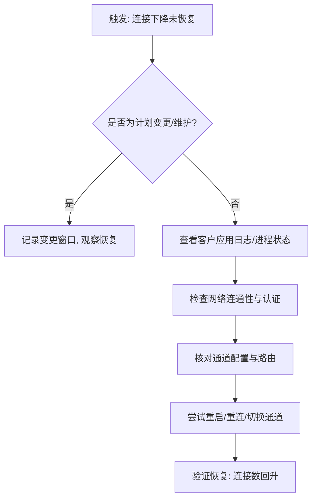
```mermaid
flowchart TD
A[触发: 连接下降未恢复] --> B{是否为计划变更/维护?}
B -- 是 --> B1[记录变更窗口, 观察恢复]
B -- 否 --> C[查看客户应用日志/进程状态]
C --> D[检查网络连通性与认证]
D --> E[核对通道配置与路由]
E --> F[尝试重启/重连/切换通道]
F --> G[验证恢复: 连接数回升]
```

- 检查项清单:
  - 客户应用进程是否存活与重启记录
  - 网络连通性（到网关/供应商）
  - 认证配置与凭据有效期
  - 通道路由及速率限制
- 业务影响: 无连接导致业务请求无法投递或回执缺失。
- 解决建议: 复位连接、修复配置、与供应商核对通道状态、必要时降压与切换备用通道。

**示例说明**
- 断联前连接数: `{{ $values.PRE.Value }}`，时间: `{{ $values.PRE.Time }}`（以告警里的数据为准）

---

## ℹ️ 连接恢复通知
- 标题: CustomerAppConnectionsRecover5mPattern  
- 来源: `grafana-alerts-customer-app-conn-drop-instance.yaml` / uid: `app_conn_recover_notice_1m`
- 告警含义: 这条通知表示：连接已经回来了，最近几次都不是 0，符合“恢复”的规律。

**关键指标说明**

| 指标名称 | 含义 | 窗口 | 阈值 | 基线/门槛 | 维度标签 |
|---|---|---|---|---|---|
| 模式匹配A | 最近 3 次 >0，且更早 2 次 =0 | 5m | 匹配 | 无 | `name/appName/cId/appId` |
| POST | 恢复后连接数（当前时刻） | 5m | 展示 | 采样间隔 30s | 同上 |

- 业务影响: 连接恢复后，业务可以正常继续。
- 建议: 记下恢复时间和原因，观察大约 30 分钟是否稳定。

**示例说明**
- 恢复后的连接数: `{{ $values.POST.Value }}`，时间: `{{ $values.POST.Time }}`

---

## ⚠️ 登录失败数升高
- 标题: CustomerLoginFailureCountHigh1m  
- 来源: `grafana-alerts-customer-app-conn-drop-instance.yaml` / uid: `customer_login_failure_count_high_1m`
- 告警含义: 每分钟登录失败超过 5 次，并且连着 3 分钟都这样。

**关键指标说明**

| 指标名称 | 含义 | 窗口 | 阈值 | 基线/门槛 | 维度标签 |
|---|---|---|---|---|---|
| 登录失败数 | `reason != 连接成功` 的失败次数 | 1m | > 5（持续3m） | 无 | `appId` |

- 正常参考: 登录失败一般应该很少，稳定在低水平。
- 常见场景: 比如密码过期、登录服务出问题、权限规则改了。
- 排查/建议: 先确认账号配置和凭据是否有效；看看认证服务是否正常；有异常改动就先回滚。
**排查指导**

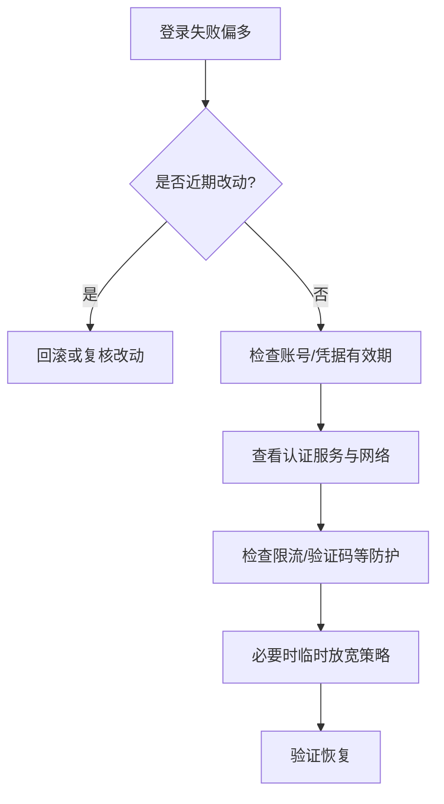
```mermaid
flowchart TD
A[登录失败偏多] --> B{是否近期改动?}
B -- 是 --> B1[回滚或复核改动]
B -- 否 --> C[检查账号/凭据有效期]
C --> D[查看认证服务与网络]
D --> E[检查限流/验证码等防护]
E --> F[必要时临时放宽策略]
F --> G[验证恢复]
```

- 检查项清单: 账号状态、凭据有效期、认证服务健康、网络连通
- 业务影响: **用户无法登录**，可能造成**投诉与流失**。
- 解决建议: **修复认证服务**、**更新凭据**、**回滚异常策略**。
- 示例说明: 过去 1 分钟失败数 ≈ `{{ $values.A.Value }}`（以告警为准）。

---

## 🛑 p99 交付时延异常
- 标题: CustomerDeliverLatencyP99Critical  
- 来源: `grafana-alerts-customer-deliver-latency-instance.yaml` / uid: `deliver_latency_p99_critical`
- 告警含义: 最慢的那 1% 请求用了 20 秒以上，尾部很慢，就像堵车尾部一直不动。

**关键指标说明**

| 指标名称 | 含义 | 窗口 | 阈值 | 基线/门槛 | 维度标签 |
|---|---|---|---|---|---|
| p99 | 99% 请求耗时 | 5m | ≥ 20000ms（持续3m） | 5m内总量≥100 | `name/appName/cId/appId` |

- 正常参考: 建议把 p99 控制在 10 秒以内；尾部慢通常和下游或网络有关。
- 场景: 下游阻塞、网络拥塞、批量任务占用资源、限流不当。
- 排查/建议: 先看看业务量和机器资源够不够；再检查下游接口和网络；压力太大就先少放点流量，或临时加机器，必要时换通道。
**排查指导**

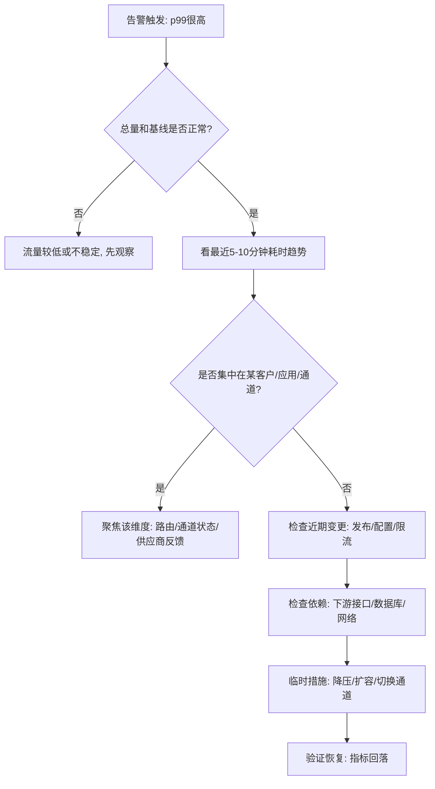
```mermaid
flowchart TD
A[告警触发: p99很高] --> B{总量和基线是否正常?}
B -- 否 --> B1[流量较低或不稳定, 先观察]
B -- 是 --> C[看最近5-10分钟耗时趋势]
C --> D{是否集中在某客户/应用/通道?}
D -- 是 --> D1[聚焦该维度: 路由/通道状态/供应商反馈]
D -- 否 --> E[检查近期变更: 发布/配置/限流]
E --> F[检查依赖: 下游接口/数据库/网络]
F --> G[临时措施: 降压/扩容/切换通道]
G --> H[验证恢复: 指标回落]
```

- 检查项清单: 活动或流量突增、下游接口、网络链路、限流与重试策略
- 业务影响: **响应变慢**，用户等待时间长，可能**失败率上升**与**成本增加**。
- 解决建议: **先减流**或**临时扩容**，必要时**切换更稳的通道**；问题缓解后**复盘并优化**。
- 示例说明: 当前 p99 ≈ `{{ $values.A.Value }}` ms。

---

## 🚨 p99 交付时延较高
- 标题: CustomerDeliverLatencyP99High  
- 来源: `grafana-alerts-customer-deliver-latency-instance.yaml` / uid: `deliver_latency_p99_high`

**关键指标说明**

| 指标名称 | 含义 | 窗口 | 阈值 | 基线/门槛 | 维度标签 |
|---|---|---|---|---|---|
| p99 | 99% 请求耗时 | 5m | ≥ 15000ms（持续5m） | 5m内总量≥100 | `name/appName/cId/appId` |

- 建议范围: p99 < 15000ms。
- 场景/排查: 同上。
**排查指导**

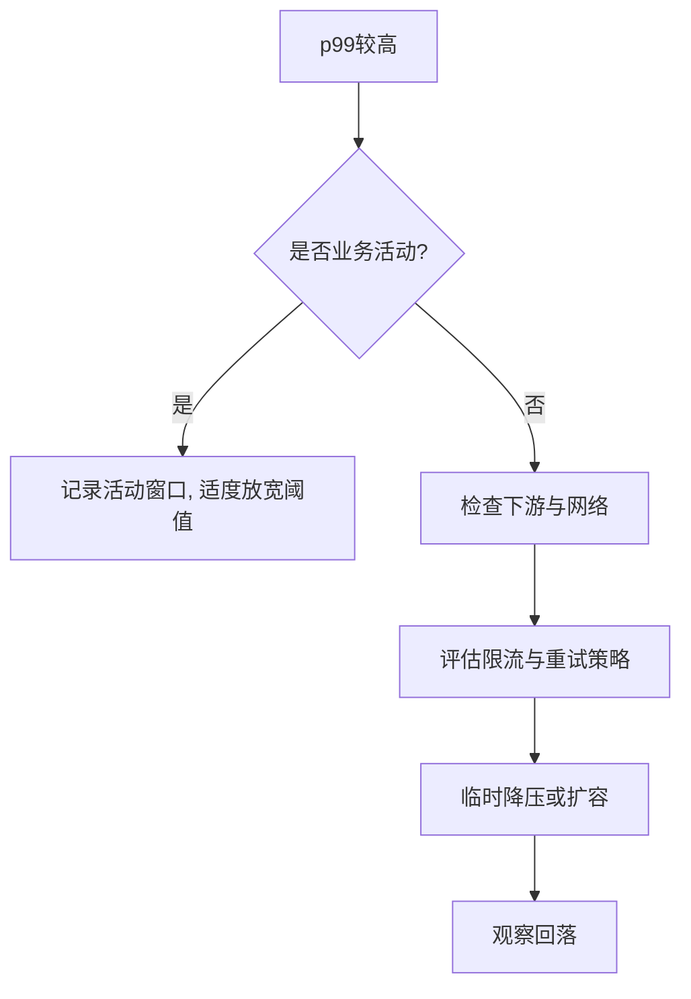
```mermaid
flowchart TD
A[p99较高] --> B{是否业务活动?}
B -- 是 --> B1[记录活动窗口, 适度放宽阈值]
B -- 否 --> C[检查下游与网络]
C --> D[评估限流与重试策略]
D --> E[临时降压或扩容]
E --> F[观察回落]
```

- 检查项清单: 活动/促销、下游接口、网络、限流重试策略
- 业务影响: **尾部体验较差**，投诉与取消可能增多。
- 解决建议: **优化重试与超时**，**热点拆分**，**隔离慢通道**。
- 示例说明: 当前 p99 ≈ `{{ $values.A.Value }}` ms。

- 建议范围: p99 < 15000ms。
- 场景/排查: 同上。

---

## ⚠️ p99 交付时延预警
- 标题: CustomerDeliverLatencyP99Warning  
- 来源: `grafana-alerts-customer-deliver-latency-instance.yaml` / uid: `deliver_latency_p99_warning`

**关键指标说明**

| 指标名称 | 含义 | 窗口 | 阈值 | 基线/门槛 | 维度标签 |
|---|---|---|---|---|---|
| p99 | 99% 请求耗时 | 5m | ≥ 10000ms（持续10m） | 5m内总量≥100 | `name/appName/cId/appId` |

**排查指导**

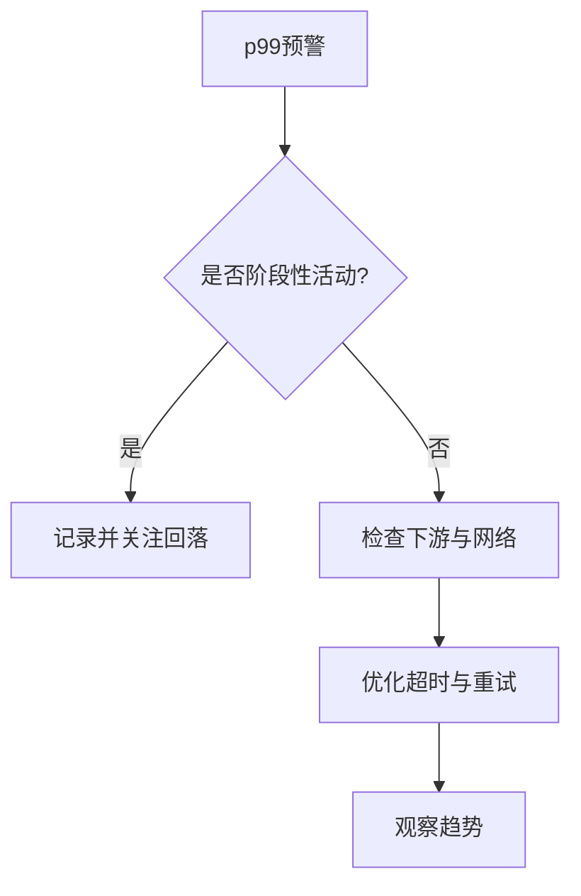
```mermaid
flowchart TD
A[p99预警] --> B{是否阶段性活动?}
B -- 是 --> B1[记录并关注回落]
B -- 否 --> C[检查下游与网络]
C --> D[优化超时与重试]
D --> E[观察趋势]
```

- 检查项清单: 活动、下游接口、网络、重试策略
- 业务影响: **尾部响应变慢**，但尚未到严重级别。
- 解决建议: **提前降压**或**优化重试**，避免进一步恶化。
- 示例说明: 当前 p99 ≈ `{{ $values.A.Value }}` ms。

---

## 🚨 p95 交付时延较高
- 标题: CustomerDeliverLatencyP95High  
- 来源: `grafana-alerts-customer-deliver-latency-instance.yaml` / uid: `deliver_latency_p95_high`

| 指标名称 | 含义 | 窗口 | 阈值 | 基线/门槛 | 维度标签 |
|---|---|---|---|---|---|
| p95 | 95% 请求耗时 | 5m | ≥ 8000ms（持续5m） | 5m内总量≥100 | `name/appName/cId/appId` |

**排查指导**

```mermaid
flowchart TD
A[p95较高] --> B{是否集中在某维度?}
B -- 是 --> B1[针对性优化或切换通道]
B -- 否 --> C[检查近期变更]
C --> D[优化限流与并发]
D --> E[验证回落]
```

- 检查项清单: 客户/应用/通道维度、近期变更、并发与限流
- 业务影响: **大多数用户变慢**，体验下降。
- 解决建议: **热点拆分**、**优化并发**、**切换更稳通道**。
- 示例说明: 当前 p95 ≈ `{{ $values.A.Value }}` ms。

---

## ⚠️ p95 交付时延预警
- 标题: CustomerDeliverLatencyP95Warning  
- 来源: `grafana-alerts-customer-deliver-latency-instance.yaml` / uid: `deliver_latency_p95_warning`

| 指标名称 | 含义 | 窗口 | 阈值 | 基线/门槛 | 维度标签 |
|---|---|---|---|---|---|
| p95 | 95% 请求耗时 | 5m | ≥ 6500ms（持续10m） | 5m内总量≥100 | `name/appName/cId/appId` |

**排查指导**

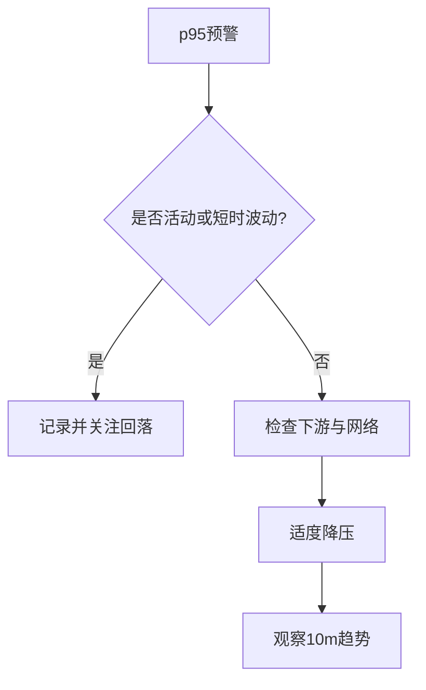
```mermaid
flowchart TD
A[p95预警] --> B{是否活动或短时波动?}
B -- 是 --> B1[记录并关注回落]
B -- 否 --> C[检查下游与网络]
C --> D[适度降压]
D --> E[观察10m趋势]
```

- 检查项清单: 活动、下游接口、网络
- 业务影响: **多数请求变慢**的早期信号。
- 解决建议: **预防性降压**与**优化依赖**。
- 示例说明: 当前 p95 ≈ `{{ $values.A.Value }}` ms。

---

## 🚨 平均交付时延较高
- 标题: CustomerDeliverLatencyAvgHigh  
- 来源: `grafana-alerts-customer-deliver-latency-instance.yaml` / uid: `deliver_latency_avg_high`

| 指标名称 | 含义 | 窗口 | 阈值 | 基线/门槛 | 维度标签 |
|---|---|---|---|---|---|
| avg | 平均请求耗时 | 5m | ≥ 8500ms（持续5m） | 5m内总量≥100 | `name/appName/cId/appId` |

**排查指导**

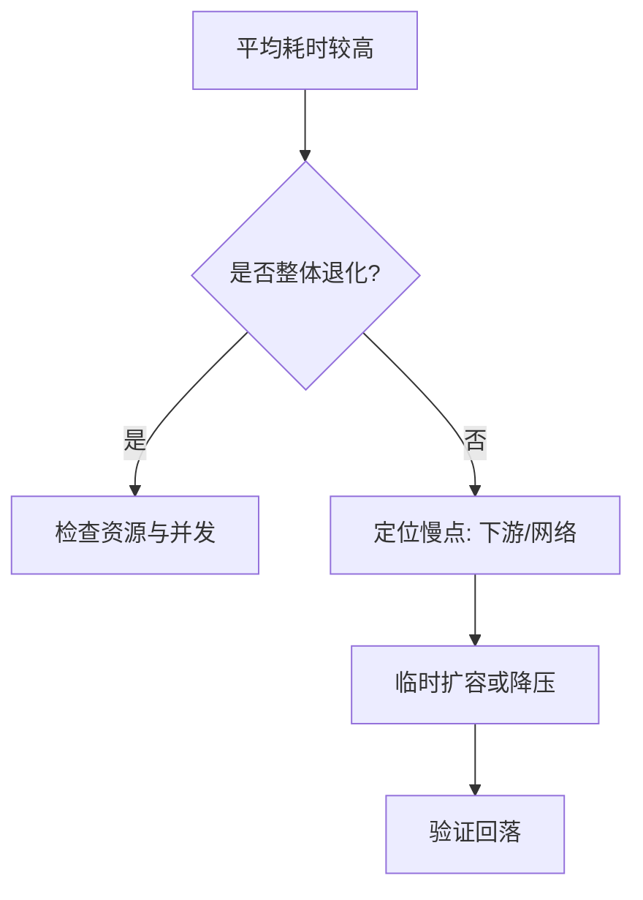
```mermaid
flowchart TD
A[平均耗时较高] --> B{是否整体退化?}
B -- 是 --> B1[检查资源与并发]
B -- 否 --> C[定位慢点: 下游/网络]
C --> D[临时扩容或降压]
D --> E[验证回落]
```

- 检查项清单: 资源使用、并发、下游接口、网络
- 业务影响: **整体变慢**，可能影响**成功率与成本**。
- 解决建议: **扩容/降压**、**优化慢依赖**。
- 示例说明: 当前平均耗时 ≈ `{{ $values.A.Value }}` ms。

---

## ⚠️ 平均交付时延预警
- 标题: CustomerDeliverLatencyAvgWarning  
- 来源: `grafana-alerts-customer-deliver-latency-instance.yaml` / uid: `deliver_latency_avg_warning`

| 指标名称 | 含义 | 窗口 | 阈值 | 基线/门槛 | 维度标签 |
|---|---|---|---|---|---|
| avg | 平均请求耗时 | 5m | ≥ 7500ms（持续10m） | 5m内总量≥100 | `name/appName/cId/appId` |

**排查指导**

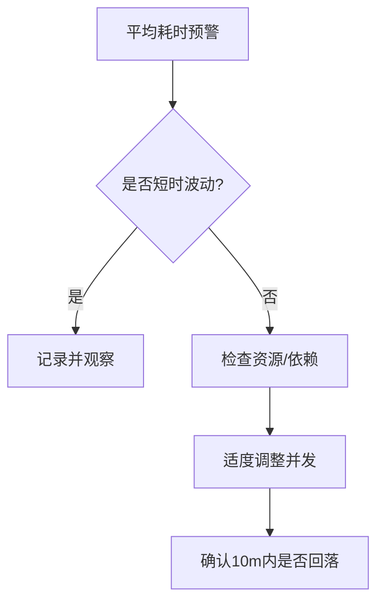
```mermaid
flowchart TD
A[平均耗时预警] --> B{是否短时波动?}
B -- 是 --> B1[记录并观察]
B -- 否 --> C[检查资源/依赖]
C --> D[适度调整并发]
D --> E[确认10m内是否回落]
```

- 检查项清单: 资源、并发、依赖
- 业务影响: **整体变慢**的早期信号。
- 解决建议: **预防性调优**。
- 示例说明: 当前平均耗时 ≈ `{{ $values.A.Value }}` ms。

---

## ⚠️ 交付成功率过低
- 标题: CustomerDeliverSuccessRateLow  
- 来源: `grafana-alerts-customer-deliver-quality-instance.yaml` / uid: `deliver_fail_rate_high`
- 含义: 5 分钟窗口内成功率（DELIVRD/ACCEPTD）≤ 70%，且总量≥100。

| 指标名称 | 含义 | 窗口 | 阈值 | 基线/门槛 | 维度标签 |
|---|---|---|---|---|---|
| success_rate% | 100×success/total | 5m | ≤ 70%（持续5m） | 总量≥100 | `name/appName/cId/appId` |

- 正常参考: 建议≥90%-95%。
- 场景: 下游质量下降、通道异常、内容策略/黑名单导致拒收。
**排查指导**

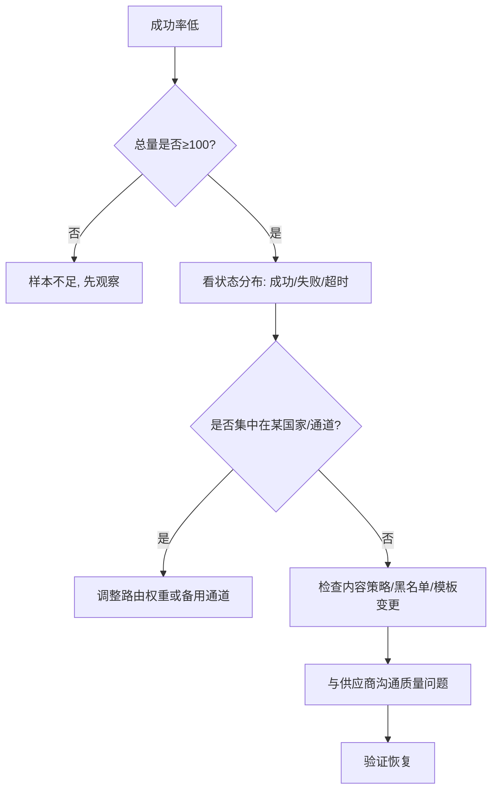
```mermaid
flowchart TD
A[成功率低] --> B{总量是否≥100?}
B -- 否 --> B1[样本不足, 先观察]
B -- 是 --> C[看状态分布: 成功/失败/超时]
C --> D{是否集中在某国家/通道?}
D -- 是 --> D1[调整路由权重或备用通道]
D -- 否 --> E[检查内容策略/黑名单/模板变更]
E --> F[与供应商沟通质量问题]
F --> G[验证恢复]
```

- 检查项清单: 总量与样本、国家/通道维度、内容/模板、黑名单策略
- 业务影响: **成功率下降**直接影响**投递效果与收入**。
- 解决建议: **临时切换高质量通道**、**优化模板与内容**、**与供应商对齐质量**。
- 示例说明: 当前成功率 ≈ `{{ $values.A.Value }}` %。

---

## ⚠️ 客户回执下降率
- 标题: CustomerReceiptDropRate  
- 来源: `grafana-alerts-customer-deliver-quality-instance.yaml` / uid: `customer_receipt_drop_rate`
- 含义: 现在 1 分钟里“收到回信”的比例，比过去 30 分钟的平均水平掉了 5% 以上，而且数量门槛也满足。

| 指标名称 | 含义 | 窗口 | 阈值 | 基线/门槛 | 维度标签 |
|---|---|---|---|---|---|
| drop_pct | 相对 30m 基线的下降比例 | 30m/1m | ≥ 5%（持续3m） | 绝对下降≥10；总量均值≥100 | `name/appName/cId/appId` |
| cur_ratio | 当前 1m 回执比例 | 1m | 展示 | — | 同上 |
| base_ratio | 30m 基线回执比例 | 30m | 展示 | >0 | 同上 |

- 常见场景: 比如某个国家或通道波动、路由权重调整、内容合规导致拦截。
**排查指导**

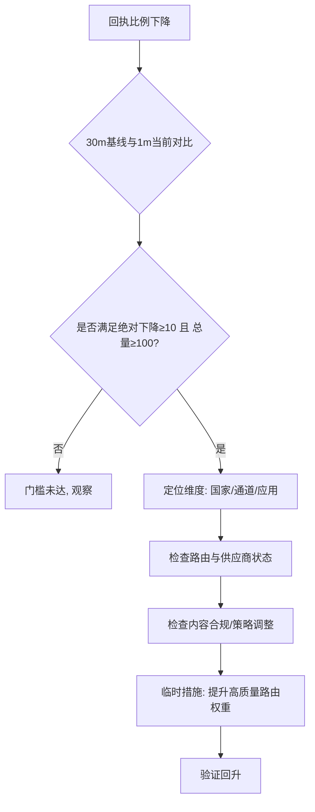
```mermaid
flowchart TD
A[回执比例下降] --> B{30m基线与1m当前对比}
B --> C{是否满足绝对下降≥10 且 总量≥100?}
C -- 否 --> C1[门槛未达, 观察]
C -- 是 --> D[定位维度: 国家/通道/应用]
D --> E[检查路由与供应商状态]
E --> F[检查内容合规/策略调整]
F --> G[临时措施: 提升高质量路由权重]
G --> H[验证回升]
```

- 检查项清单: 30m基线、当前比例、绝对下降值、非超时总量均值
- 业务影响: **收到回信的比例降低**，导致**可用反馈减少**与**重试成本上升**。
- 解决建议: **提高稳定通道权重**、**优化内容合规**、**沟通供应商**。
- 示例说明: 当前比例 `{{ $values.H.Value }}` %，基线 `{{ $values.F.Value }}` %，降幅 `{{ $values.C.Value }}` %。

---

## ⚠️ p95 请求耗时过高
- 标题: CustomerLatencyP95High  
- 来源: `grafana-alerts-customer-latency-instance.yaml` / uid: `customer_latency_p95_high`

| 指标名称 | 含义 | 窗口 | 阈值 | 基线/门槛 | 维度标签 |
|---|---|---|---|---|---|
| p95 | 95% 请求耗时 | 5m | > 500ms（持续5m） | — | `cId/name/appId/appName` |

- 正常参考: 建议 p95 < 300–400ms。
- 常见场景: 并发过高、下游响应慢、网络抖动、限流不当。

**排查指导**

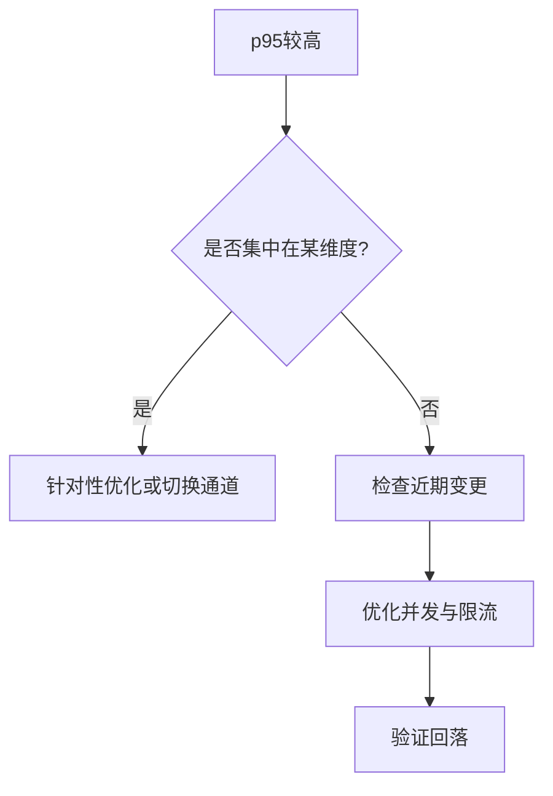
```mermaid
flowchart TD
A[p95较高] --> B{是否集中在某维度?}
B -- 是 --> B1[针对性优化或切换通道]
B -- 否 --> C[检查近期变更]
C --> D[优化并发与限流]
D --> E[验证回落]
```

- 检查项清单: 客户/应用/通道维度、近期发布或配置调整、并发与限流策略
- 业务影响: **大多数请求变慢**，用户体验下降。
- 解决建议: **热点拆分**、**优化并发**、**切换更稳通道**。
- 示例说明: 当前 p95 ≈ `{{ $values.A.Value }}` ms。

---

## 🛑 p99 请求耗时严重升高
- 标题: CustomerLatencyP99High  
- 来源: `grafana-alerts-customer-latency-instance.yaml` / uid: `customer_latency_p99_high`

| 指标名称 | 含义 | 窗口 | 阈值 | 基线/门槛 | 维度标签 |
|---|---|---|---|---|---|
| p99 | 99% 请求耗时 | 5m | > 1000ms（持续5m） | — | `cId/name/appId/appName` |

- 正常参考: 建议 p99 < 800–900ms。
- 常见场景: 下游阻塞、网络拥塞、重试风暴、热点集中。

**排查指导**

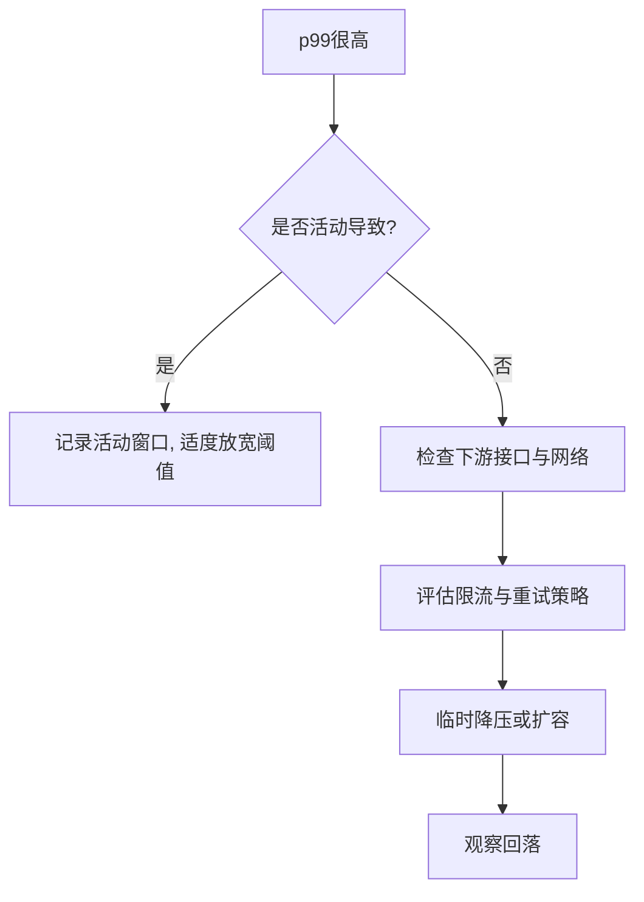
```mermaid
flowchart TD
A[p99很高] --> B{是否活动导致?}
B -- 是 --> B1[记录活动窗口, 适度放宽阈值]
B -- 否 --> C[检查下游接口与网络]
C --> D[评估限流与重试策略]
D --> E[临时降压或扩容]
E --> F[观察回落]
```

- 检查项清单: 活动/促销、下游响应、网络、重试与超时设置
- 业务影响: **尾部体验很差**，可能带来投诉与取消。
- 解决建议: **优化重试与超时**，**隔离慢通道**，**临时扩容或降压**。
- 示例说明: 当前 p99 ≈ `{{ $values.A.Value }}` ms。

---

## ⚠️ 平均请求耗时过高
- 标题: CustomerLatencyAvgHigh  
- 来源: `grafana-alerts-customer-latency-instance.yaml` / uid: `customer_latency_avg_high`

| 指标名称 | 含义 | 窗口 | 阈值 | 基线/门槛 | 维度标签 |
|---|---|---|---|---|---|
| avg | 平均请求耗时 | 5m | > 300ms（持续10m） | — | `cId/name/appId/appName` |

- 正常参考: 建议平均 < 200–250ms。
- 常见场景: 整体资源不足、慢依赖、并发策略不合理。

**排查指导**

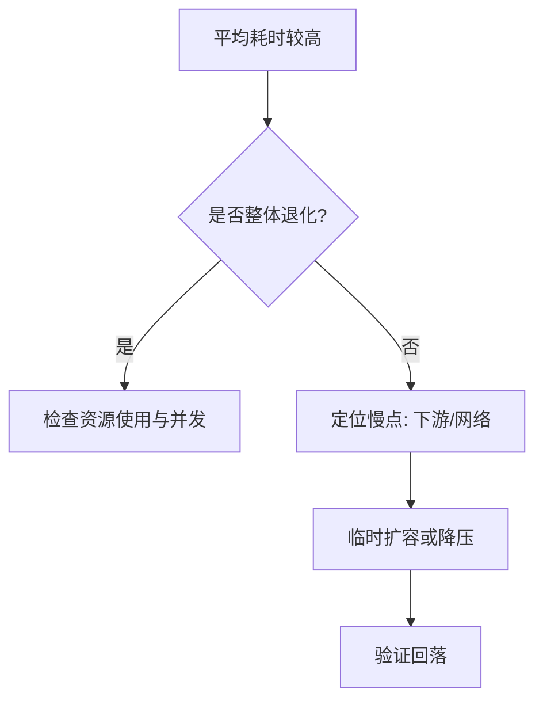
```mermaid
flowchart TD
A[平均耗时较高] --> B{是否整体退化?}
B -- 是 --> B1[检查资源使用与并发]
B -- 否 --> C[定位慢点: 下游/网络]
C --> D[临时扩容或降压]
D --> E[验证回落]
```

- 检查项清单: 资源、并发、下游接口、网络链路
- 业务影响: **整体变慢**，影响**成功率与成本**。
- 解决建议: **扩容/降压**、**优化慢依赖**。
- 示例说明: 当前平均耗时 ≈ `{{ $values.A.Value }}` ms。

---

## ⚠️ 上行成功率偏低
- 标题: MOSuccessRateLow  
- 来源: `grafana-alerts-customer-mo-quality-instance.yaml` / uid: `mo_success_rate_low`

| 指标名称 | 含义 | 窗口 | 阈值 | 基线/门槛 | 维度标签 |
|---|---|---|---|---|---|
| success_rate% | 100×success(stat=0)/total | 5m | ≤ 95%（持续5m） | 总量≥50 | `name/appName/cId/appId` |

**排查指导**

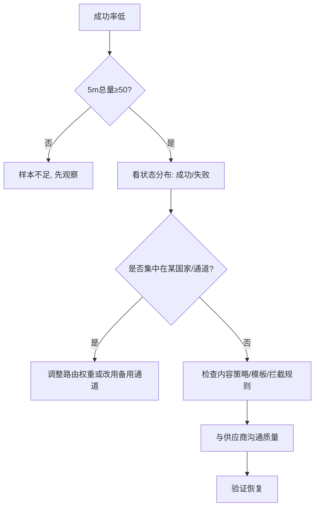
```mermaid
flowchart TD
A[成功率低] --> B{5m总量≥50?}
B -- 否 --> B1[样本不足, 先观察]
B -- 是 --> C[看状态分布: 成功/失败]
C --> D{是否集中在某国家/通道?}
D -- 是 --> D1[调整路由权重或改用备用通道]
D -- 否 --> E[检查内容策略/模板/拦截规则]
E --> F[与供应商沟通质量]
F --> G[验证恢复]
```

- 检查项清单: 总量样本、国家/通道维度、内容/模板、拦截策略
- 业务影响: **成功率下降**影响**投递效果与收入**。
- 解决建议: **临时切换高质量通道**、**优化模板与内容**。
- 示例说明: 当前成功率 ≈ `{{ $values.A.Value }}` %。

---

## ⚠️ 请求-响应差值偏高
- 标题: MOReqRespGapHigh  
- 来源: `grafana-alerts-customer-mo-quality-instance.yaml` / uid: `mo_req_resp_gap_high`

| 指标名称 | 含义 | 窗口 | 阈值 | 基线/门槛 | 维度标签 |
|---|---|---|---|---|---|
| gap% | 100×clamp(req-resp)/req | 5m | ≥ 10%（持续5m） | 总量≥50 | `name/appName/cId/appId` |

**排查指导**

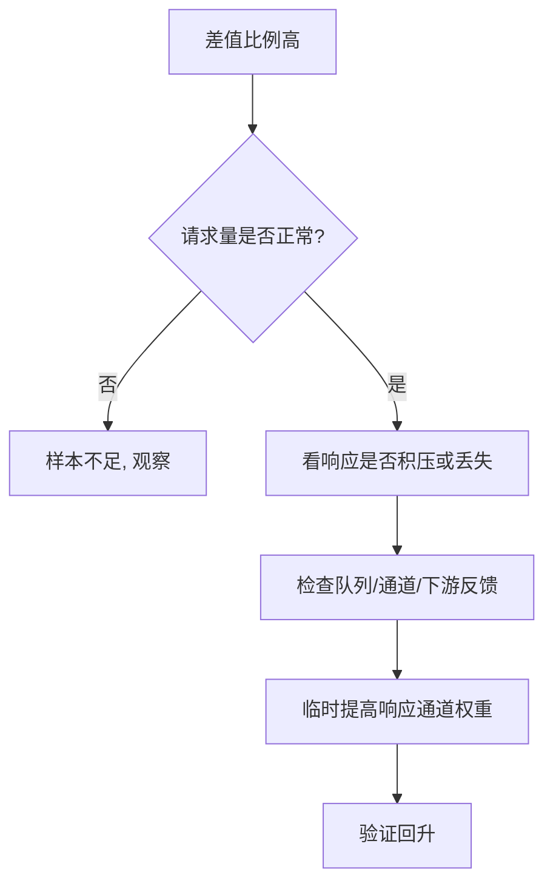
```mermaid
flowchart TD
A[差值比例高] --> B{请求量是否正常?}
B -- 否 --> B1[样本不足, 观察]
B -- 是 --> C[看响应是否积压或丢失]
C --> D[检查队列/通道/下游反馈]
D --> E[临时提高响应通道权重]
E --> F[验证回升]
```

- 检查项清单: 请求与响应量、队列积压、通道状态、下游反馈
- 业务影响: **应答缺失或阻塞**，影响**用户体验与成功率**。
- 解决建议: **提升稳定通道权重**、**疏通队列**。
- 示例说明: 当前差值比例 ≈ `{{ $values.A.Value }}` %。

---

## ⚠️ 上行错误率偏高
- 标题: MOErrorRateHigh  
- 来源: `grafana-alerts-customer-mo-quality-instance.yaml` / uid: `mo_error_rate_high`

| 指标名称 | 含义 | 窗口 | 阈值 | 基线/门槛 | 维度标签 |
|---|---|---|---|---|---|
| error_rate% | 100×error(stat!=0)/total | 5m | ≥ 5%（持续5m） | 总量≥50 | `name/appName/cId/appId` |

**排查指导**

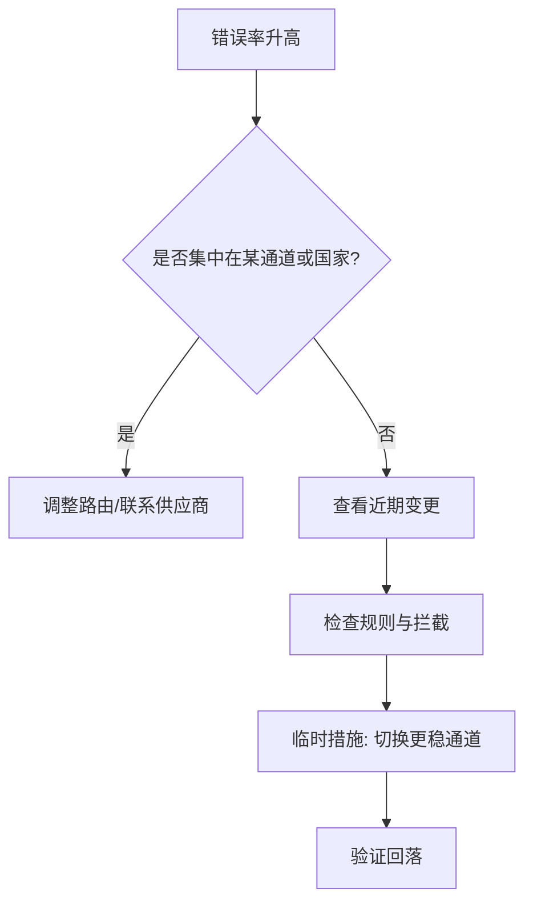
```mermaid
flowchart TD
A[错误率升高] --> B{是否集中在某通道或国家?}
B -- 是 --> B1[调整路由/联系供应商]
B -- 否 --> C[查看近期变更]
C --> D[检查规则与拦截]
D --> E[临时措施: 切换更稳通道]
E --> F[验证回落]
```

- 检查项清单: 通道/国家维度、变更记录、拦截规则
- 业务影响: **失败增多**，直接影响**成功率与成本**。
- 解决建议: **切换稳定通道**、**优化规则**。
- 示例说明: 当前错误率 ≈ `{{ $values.A.Value }}` %。

---

## ⚠️ 上行 TPS 激增
- 标题: MOTpsSurge  
- 来源: `grafana-alerts-customer-mo-quality-instance.yaml` / uid: `mo_tps_surge`

| 指标名称 | 含义 | 窗口 | 阈值 | 基线/门槛 | 维度标签 |
|---|---|---|---|---|---|
| surge | 5m QPS > 3×1h基线 | 5m vs 1h | 匹配（持续5m） | 当前QPS>20 | `name/appName/cId/appId` |

**排查指导**

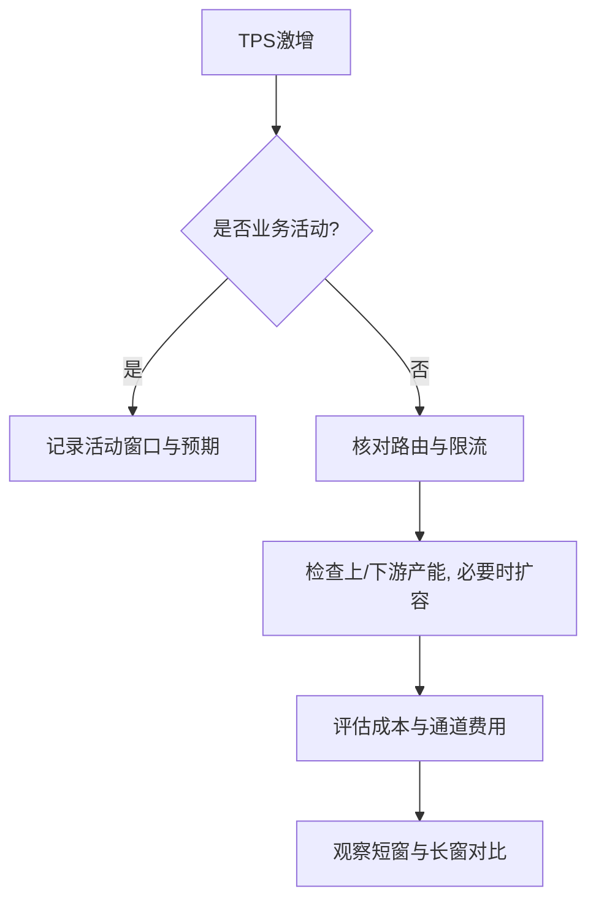
```mermaid
flowchart TD
A[TPS激增] --> B{是否业务活动?}
B -- 是 --> B1[记录活动窗口与预期]
B -- 否 --> C[核对路由与限流]
C --> D[检查上/下游产能, 必要时扩容]
D --> E[评估成本与通道费用]
E --> F[观察短窗与长窗对比]
```

- 检查项清单: 活动、路由、限流、产能、成本
- 业务影响: **流量猛增**可能挤占资源，导致**延迟与失败**。
- 解决建议: **调权路由/扩容**，**短期限流**。
- 示例说明: 当前5m QPS ≈ `{{ $values.E.Value }}`，1h基线 QPS ≈ `{{ $values.F.Value }}`。

---

## ℹ️ 提交失败率信息级
- 标题: CustomerSubmitFailureRateInfoShort  
- 来源: `grafana-alerts-customer-submit-failure-instance.yaml` / uid: `customer_submit_failure_rate_info_short`

| 指标名称 | 含义 | 窗口 | 阈值 | 基线/门槛 | 维度标签 |
|---|---|---|---|---|---|
| failure_rate | 失败/总提交 | 5m | > 2%（信息级） | 总量≥50 | `name/appName/cId/appId` |

**排查指导**

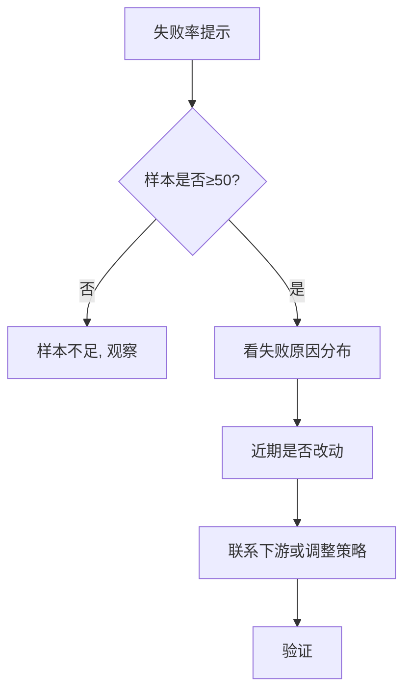
```mermaid
flowchart TD
A[失败率提示] --> B{样本是否≥50?}
B -- 否 --> B1[样本不足, 观察]
B -- 是 --> C[看失败原因分布]
C --> D[近期是否改动]
D --> E[联系下游或调整策略]
E --> F[验证]
```

- 检查项清单: 总量样本、失败原因、近期改动
- 业务影响: **短时异常提醒**，便于及时关注。
- 解决建议: **先定位原因**，必要时**临时降压或调整策略**。
- 示例说明: 当前失败率提示触发，5m数据满足条件。

---

## ⚠️ 客户侧TPS总量激增30%(Warning)
- 标题: 客户侧TPS总量激增30%(Warning)
- 来源: `grafana-alerts-customer-tps-surge-instance.yaml`
- 告警含义: 当前 1m TPS 相对 30m 基线激增 ≥ 30%，且基线 ≥ 100，持续 3m。

| 指标名称 | 含义 | 窗口 | 阈值 | 基线/门槛 | 维度 |
|---|---|---|---|---|---|
| surge_ratio% | 100×(1m/30m均值-1) | 30m 对 1m | ≥ 30%（3m） | 基线≥100 TPS | `name/appName/cId/appId` |

- 正常参考: 活动外通常应 < 20%。
- 常见场景: 活动促销、批量任务、路由权重异常。

**排查指导**

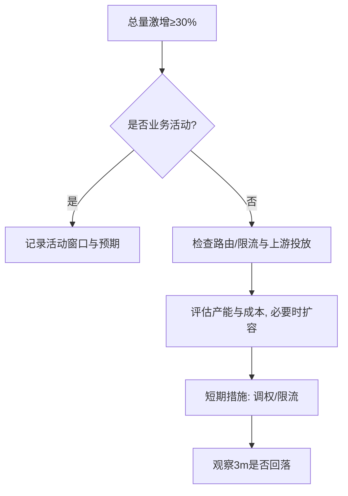
```mermaid
flowchart TD
A[总量激增≥30%] --> B{是否业务活动?}
B -- 是 --> B1[记录活动窗口与预期]
B -- 否 --> C[检查路由/限流与上游投放]
C --> D[评估产能与成本, 必要时扩容]
D --> E[短期措施: 调权/限流]
E --> F[观察3m是否回落]
```

- 检查项清单: 30m基线、当前TPS、活动与路由、限流与产能
- 业务影响: **流量猛增**可能引发**延迟/失败**与**成本上升**。
- 解决建议: **分流与扩容**，**临时限流**。
- 示例说明: 当前 1m TPS ≈ `{{ $values.A.Value }}`；30m基线 ≈ `{{ $values.TT.Value }}`。

---

## 🚨 客户侧TPS总量激增50%(High)
- 标题: 客户侧TPS总量激增50%(High)
- 来源: `grafana-alerts-customer-tps-surge-instance.yaml`
- 告警含义: 当前 1m TPS 相对 30m 基线激增 ≥ 50%，且基线 ≥ 100，持续 3m。

| 指标名称 | 含义 | 窗口 | 阈值 | 基线/门槛 | 维度 |
|---|---|---|---|---|---|
| surge_ratio% | 100×(1m/30m均值-1) | 30m 对 1m | ≥ 50%（3m） | 基线≥100 TPS | `name/appName/cId/appId` |

- 正常参考: 活动期外不应达到 50%。
- 常见场景: 大促、接口误触发、路由集中分配。

**排查指导**

```mermaid
flowchart TD
A[总量激增≥50%] --> B{是否活动/批量}
B -- 是 --> B1[与预期比对, 资源保障]
B -- 否 --> C[检查路由异常与限流设置]
C --> D[扩容/调权, 控制峰值]
D --> E[观察回落并记录]
```

- 检查项清单: 活动、路由、限流、产能
- 业务影响: **延迟与失败风险显著增加**。
- 解决建议: **扩容与分流**，**成本评估**。
- 示例说明: 参考告警注解当前与基线数值。

---

## 🛑 客户侧TPS总量激增70%(Critical)
- 标题: 客户侧TPS总量激增70%(Critical)
- 来源: `grafana-alerts-customer-tps-surge-instance.yaml`
- 告警含义: 当前 1m TPS 相对 30m 基线激增 ≥ 70%，且基线 ≥ 100，持续 3m。

| 指标名称 | 含义 | 窗口 | 阈值 | 基线/门槛 | 维度 |
|---|---|---|---|---|---|
| surge_ratio% | 100×(1m/30m均值-1) | 30m 对 1m | ≥ 70%（3m） | 基线≥100 TPS | `name/appName/cId/appId` |

- 常见场景: 极端活动、路由错误、重试风暴。

**排查指导**

```mermaid
flowchart TD
A[总量激增≥70%] --> B[立即降压与扩容]
B --> C[切分路由与隔离热点]
C --> D[核查重试策略避免风暴]
D --> E[持续监控与记录]
```

- 检查项清单: 路由、限流、重试、产能
- 业务影响: **重大影响**，需立即响应。
- 解决建议: **强制限流/分流**，**快速扩容**。
- 示例说明: 参考告警注解当前与基线数值。

---

## ⚠️ 客户侧TPS短时窗口激增(2-3分钟)
- 标题: 客户侧TPS短时窗口激增(2-3分钟)
- 来源: `grafana-alerts-customer-tps-surge-instance.yaml`
- 告警含义: 1m 对 3m 均值的绝对 TPS 激增（≥100 TPS），且 > 1.5×3m均值，持续 2m。

| 指标名称 | 含义 | 窗口 | 阈值 | 其他门槛 | 维度 |
|---|---|---|---|---|---|
| abs_surge | 1m 绝对 TPS 激增 | 3m 对 1m | ≥100 TPS（2m） | >1.5×3m均值 | `name/appName/cId/appId` |

**排查指导**

```mermaid
flowchart TD
A[短窗绝对激增] --> B{是否活动/批量}
B -- 是 --> B1[资源保障, 临时扩容]
B -- 否 --> C[检查路由异常]
C --> D[短期限流与分流]
D --> E[观察2-3m是否回落]
```

- 检查项清单: 1m与3m对比、绝对阈值、均值比例
- 业务影响: **瞬时峰值**可能压垮下游。
- 解决建议: **短期限流与分流**。
- 示例说明: 参考 1m 与 3m 指标数值。

---

## ⚠️ 客户侧TPS按客户+应用组合分组激增30%
- 标题: 客户侧TPS按客户+应用组合分组激增30%
- 来源: `grafana-alerts-customer-tps-surge-instance.yaml`
- 含义: 某客户+应用分组 1m 相对 30m 均值激增 ≥ 30%，持续 3m，基线 ≥ 20。

| 指标名称 | 含义 | 窗口 | 阈值 | 基线 | 维度 |
|---|---|---|---|---|---|
| group_surge% | 100×(1m/30m均值-1) | 30m 对 1m | ≥30%（3m） | ≥20 TPS | `name/appName` |

**排查指导**

```mermaid
flowchart TD
A[分组激增≥30%] --> B[锁定客户+应用分组]
B --> C[检查该分组路由与限流]
C --> D[分流至备用通道]
D --> E[观察回落]
```

- 检查项清单: 分组基线、路由、限流
- 业务影响: **单客/单应用冲击**。
- 解决建议: **分组限流**、**分流**。
- 示例说明: 参考分组当前与基线。

---

## 🚨 客户侧TPS按客户+应用组合分组激增50%
- 标题: 客户侧TPS按客户+应用组合分组激增50%
- 来源: `grafana-alerts-customer-tps-surge-instance.yaml`

| 指标名称 | 含义 | 窗口 | 阈值 | 基线 | 维度 |
|---|---|---|---|---|---|
| group_surge% | 100×(1m/30m均值-1) | 30m 对 1m | ≥50%（3m） | ≥20 TPS | `name/appName` |

流程图/清单/影响/建议与 30% 章节一致，但阈值提高。

---

## 🛑 客户侧TPS按客户+应用组合分组激增70%
- 标题: 客户侧TPS按客户+应用组合分组激增70%
- 来源: `grafana-alerts-customer-tps-surge-instance.yaml`

| 指标名称 | 含义 | 窗口 | 阈值 | 基线 | 维度 |
|---|---|---|---|---|---|
| group_surge% | 100×(1m/30m均值-1) | 30m 对 1m | ≥70%（3m） | ≥20 TPS | `name/appName` |

立即分流与限流，参考 30%/50% 章节措施。

---

## ⚠️ 客户侧TPS按客户应用名称短时窗口激增
- 标题: 客户侧TPS按客户应用名称短时窗口激增
- 来源: `grafana-alerts-customer-tps-surge-instance.yaml`
- 含义: 1m 对 3m 均值的绝对 TPS 激增（分组维度），满足短窗门槛。

| 指标名称 | 含义 | 窗口 | 阈值 | 其他门槛 | 维度 |
|---|---|---|---|---|---|
| group_abs_surge | 1m 绝对 TPS 激增 | 3m 对 1m | 绝对门槛 | 与均值比例门槛 | `name/appName` |

排查/建议：参考短窗绝对激增章节执行分组限流与分流。

---

## ⚠️ 客户侧TPS按客户+应用+通道三维分组激增30%
- 标题: 客户侧TPS按客户+应用+通道三维分组激增30%
- 来源: `grafana-alerts-customer-tps-surge-instance.yaml`
- 含义: 某三维分组 1m 相对 30m 均值激增 ≥ 30%，持续 3m，基线 ≥ 10。

| 指标名称 | 含义 | 窗口 | 阈值 | 基线 | 维度 |
|---|---|---|---|---|---|
| tri_surge% | 100×(1m/30m均值-1) | 30m 对 1m | ≥30%（3m） | ≥10 TPS | `name/appName/connectId` |

排查/建议：锁定三维分组，分流或切换通道，观察回落。

---

## 🚨 客户侧TPS按客户+应用+通道三维分组激增50%
- 标题: 客户侧TPS按客户+应用+通道三维分组激增50%
- 来源: `grafana-alerts-customer-tps-surge-instance.yaml`

| 指标名称 | 含义 | 窗口 | 阈值 | 基线 | 维度 |
|---|---|---|---|---|---|
| tri_surge% | 100×(1m/30m均值-1) | 30m 对 1m | ≥50%（3m） | ≥8 TPS | `name/appName/connectId` |

措施参考 30% 章节，但更快执行，严控峰值。

---

## 🛑 客户侧TPS按客户+应用+通道三维分组激增70%
- 标题: 客户侧TPS按客户+应用+通道三维分组激增70%
- 来源: `grafana-alerts-customer-tps-surge-instance.yaml`

| 指标名称 | 含义 | 窗口 | 阈值 | 基线 | 维度 |
|---|---|---|---|---|---|
| tri_surge% | 100×(1m/30m均值-1) | 30m 对 1m | ≥70%（3m） | ≥8 TPS | `name/appName/connectId` |

立即限流与分流，切换稳定通道，记录处置。

---

## ⚠️ 客户侧TPS按客户+应用+通道三维短时窗口激增
- 标题: 客户侧TPS按客户+应用+通道三维短时窗口激增
- 来源: `grafana-alerts-customer-tps-surge-instance.yaml`
- 含义: 1m 对 3m 均值的绝对 TPS 激增（≥50 TPS），且 > 1.3×3m均值，持续 2m。

| 指标名称 | 含义 | 窗口 | 阈值 | 其他门槛 | 维度 |
|---|---|---|---|---|---|
| tri_abs_surge | 1m 绝对 TPS 激增 | 3m 对 1m | ≥50 TPS（2m） | >1.3×3m均值 | `name/appName/connectId` |

排查/建议：参考短窗绝对激增章节执行三维分流与限流。

---

---

# Supplier 侧告警

## ⚠️ 供应商应用连接下降未恢复
- 标题: SupplierAppConnectionsDropAlert  
- 来源: `grafana-alerts-supplier-conn-drop-instance.yaml` / uid: `supplier_app_conn_drop_alert`

| 指标名称 | 含义 | 窗口 | 阈值 | 基线/门槛 | 维度 |
|---|---|---|---|---|---|
| A | 实际连接数（max） | 3m | 与基线不等 | 10m有连接 | `name/appName/cId/appId` |
| B | 标准连接数（total avg） | 3m | 展示 | total>0 | 同上 |
| ZE/ZN | 3m等于/2m不等于状态 | 3m/2m | ZE==0 且 ZN>0 | — | 同上 |

- 含义: 实际连接与标准连接不相等持续 2 分钟，判定连接下降。

**排查指导**

```mermaid
flowchart TD
A[连接下降] --> B{是否近期变更?}
B -- 是 --> B1[回滚/复核]
B -- 否 --> C[检查通道与认证]
C --> D[网络连通性]
D --> E[临时重连或切换通道]
E --> F[验证恢复]
```

- 检查项清单: 通道状态、认证、网络、变更记录
- 业务影响: **连接缺失**导致**无法投递或无回执**。
- 解决建议: **重连/切换**、**修复配置**。
- 示例说明: 当前实际与标准连接差值见告警注解。

---

## ℹ️ 供应商连接恢复通知
- 标题: SupplierAppConnectionsRecoveredAlert  
- 来源: `grafana-alerts-supplier-conn-drop-instance.yaml` / uid: `supplier_app_conn_recovered`

| 指标名称 | 含义 | 窗口 | 阈值 |
|---|---|---|---|
| ZRE_NE/ZRE_EQ | 2m不等→3m等于 | 2m/3m | 满足恢复模式 |

- 说明: 已恢复，建议记录恢复时间与原因，观察稳定性约 30 分钟。

---

## ⚠️ 回执比例过低
- 标题: SupplierDeliverReceiptRateLow  
- 来源: `grafana-alerts-supplier-deliver-instance.yaml` / uid: `sdr_rate_low`

| 指标名称 | 含义 | 窗口 | 阈值 | 基线 |
|---|---|---|---|---|
| receipt_rate | 非超时回执/总量 | 30m | < 0.85（for 2m） | 30m总量≥100 |

**排查指导**

```mermaid
flowchart TD
A[回执低] --> B{30m总量≥100?}
B -- 否 --> B1[样本不足, 观察]
B -- 是 --> C[看国家/通道维度]
C --> D[调整路由权重]
D --> E[与供应商对齐质量]
E --> F[验证恢复]
```

- 检查项清单: 总量、国家/通道维度、路由权重、供应商反馈
- 业务影响: **回执减少**，影响**反馈与重试**。
- 解决建议: **提高稳定通道权重**、**沟通供应商**。

---

## ⚠️ 超时比例过高
- 标题: SupplierDeliverTimeoutRateHigh  
- 来源: 同上 / uid: `sdt_rate_high`

| 指标名称 | 含义 | 窗口 | 阈值 | 基线 |
|---|---|---|---|---|
| timeout_rate | 超时/总量 | 30m | > 0.15（for 2m） | 30m总量≥100 |

**排查指导**

```mermaid
flowchart TD
A[超时高] --> B{是否集中在某国家/通道?}
B -- 是 --> B1[调整路由/联系供应商]
B -- 否 --> C[检查网络与依赖]
C --> D[优化超时与重试]
D --> E[验证]
```

- 检查项清单: 国家/通道、网络、依赖、超时与重试设置
- 业务影响: **超时增多**，影响**体验与成本**。
- 解决建议: **优化路由与策略**。

---

## ⚠️ 失败率短时激增
- 标题: SupplierDeliverFailureRateSurge  
- 来源: 同上 / uid: `sd_failure_rate_surge`

| 指标名称 | 含义 | 窗口 | 阈值 | 其他 |
|---|---|---|---|---|
| surge_ratio | 5m失败率/30m失败率 | 5m vs 30m | >2 且 5m失败率>5% | 5m总量≥30 |

**排查指导**

```mermaid
flowchart TD
A[失败率激增] --> B{5m失败率是否>5%?}
B -- 否 --> B1[关注但暂不处理]
B -- 是 --> C[与30m对比是否倍增]
C -- 是 --> D[定位国家/通道]
D --> E[临时切换更稳通道]
E --> F[验证回落]
```

- 检查项清单: 5m与30m失败率对比、维度定位、路由
- 业务影响: **短时失败猛增**，需快速处置。
- 解决建议: **短期分流与切换通道**。

---

## ⚠️ 国家维度失败率过高
- 标题: SupplierDeliverFailureRateByCountry  
- 来源: 同上 / uid: `sd_failure_rate_by_country`

| 指标名称 | 含义 | 窗口 | 阈值 | 基线 |
|---|---|---|---|---|
| failure_rate | 失败/总量 | 30m | > 0.10（for 3m） | 30m总量≥100 |

- 排查与建议: 参考失败率激增的维度定位与路由策略；优先处理高占比国家。
- 示例说明: 当前国家失败率与总量见告警注解 `{{ $values.RR.Value }}` / `{{ $values.TT.Value }}`。
**排查指导**

```mermaid
flowchart TD
A[国家失败率>10%] --> B{30m总量≥100?}
B -- 否 --> B1[样本不足, 观察]
B -- 是 --> C[锁定国家维度]
C --> D[检查路由/通道状态]
D --> E[与供应商沟通质量]
E --> F[分流至高质量通道]
F --> G[验证回落]
```

**检查项清单**: 总量、失败原因分布、国家/通道权重、供应商反馈

---

## ⚠️ 国家维度回执比例过低
- 标题: SupplierDeliverReceiptRateLowByCountry  
- 来源: 同上 / uid: `sd_receipt_r_low_by_country`

| 指标名称 | 含义 | 窗口 | 阈值 | 基线 |
|---|---|---|---|---|
| receipt_rate | 非超时回执/总量 | 30m | < 0.85（for 3m） | 30m总量≥100 |

- 排查与建议: 参考回执比例过低的定位方法；加强稳定通道路由。
- 示例说明: 当前国家回执比例与总量见 `{{ $values.RR.Value }}` / `{{ $values.TT.Value }}`。
**排查指导**

```mermaid
flowchart TD
A[国家回执比例<85%] --> B{样本与基线满足?}
B -- 否 --> B1[样本不足, 观察]
B -- 是 --> C[锁定国家与通道]
C --> D[检查超时/拒收占比]
D --> E[提高稳定通道权重]
E --> F[优化模板与内容]
F --> G[验证回升]
```

**检查项清单**: 基线与当前比例、超时/拒收占比、通道权重、内容/模板

---

## ⚠️ 国家维度超时比例过高
- 标题: SupplierDeliverTimeoutRateHighByCountry  
- 来源: 同上 / uid: `sdt_rate_high_by_country`

| 指标名称 | 含义 | 窗口 | 阈值 | 基线 |
|---|---|---|---|---|
| timeout_rate | 超时/总量 | 30m | > 0.15（for 3m） | 30m总量≥100 |

- 排查与建议: 参考超时比例过高的定位方法；必要时与供应商排查通道故障。
- 示例说明: 当前国家超时比例与总量见 `{{ $values.RR.Value }}` / `{{ $values.TT.Value }}`。
**排查指导**

```mermaid
flowchart TD
A[国家超时率>15%] --> B{是否集中在某通道?}
B -- 是 --> B1[切换/分流该通道]
B -- 否 --> C[检查网络与依赖]
C --> D[优化超时与重试]
D --> E[验证回落]
```

**检查项清单**: 通道维度、网络链路、依赖系统、超时与重试设置

---

## ⚠️ 成功率SLO快速燃尽
- 标题: SupplierDeliverSLOBurnFast  
- 来源: `grafana-alerts-supplier-deliver-robust-instance.yaml` / uid: `sdr_slo_burn_fast`

**关键指标说明**

| 指标 | 含义 | 窗口 | 阈值 | 基线 |
|---|---|---|---|---|
| BR5/BR60 | 错误率/预算(1-0.98) | 5m/1h | > 14 | 5m≥30 且 30m≥100 |

- 说明: 快窗与慢窗的错误率都超出可用误差预算。
- 建议: **先减流或扩容**，**优化错误来源**，**稳后复盘**。

---

## ⚠️ 超时SLO快速燃尽
- 标题: SupplierDeliverTimeoutSLOBurnFast  
- 来源: 同上 / uid: `sdt_slo_burn_fast`

**关键指标说明**

| 指标 | 含义 | 窗口 | 阈值 | 基线 |
|---|---|---|---|---|
| BR5/BR60 | 超时率/预算(1-0.98) | 5m/1h | > 14 | 5m≥30 且 30m≥100 |

- 说明: 快窗与慢窗的超时率都超出预算。
- 建议: **降低压力**、**优化超时与重试**。

---

## ⚠️ 失败率Z分数异常
- 标题: SupplierDeliverFailureZScoreAnomaly  
- 来源: 同上 / uid: `sd_failure_z_anomaly`

**关键指标说明**

| 指标 | 含义 | 窗口 | 阈值 |
|---|---|---|---|
| Z | (5m失败率-1h均值)/1h标准差 | 5m vs 1h | > 3 |

- 说明: 5m相对1h均值的标准化偏差很高，异常明显。
- 建议: **定位维度并分流**，**优化热点与慢点**。

---

## ⚠️ 平滑回执比例过低
- 标题: SupplierDeliverReceiptRateLowSmooth  
- 来源: 同上 / uid: `sdr_receipt_rate_low_smooth`

**关键指标说明**

| 指标 | 含义 | 窗口 | 阈值 | 基线 |
|---|---|---|---|---|
| avg_ratio | 10m 平滑回执比例 | 10m | < 0.85（for 3m） | 30m总量≥100 |

- 说明: 10m平滑后仍低于目标，建议**检查路由与质量**。

---

## ⚠️ 成功率SLO慢速燃尽-30m
- 标题: SupplierDeliverSLOBurnSlow30m  
- 来源: 同上 / uid: `sdr_slo_burn_slow_30m`

**关键指标说明**

| 指标 | 含义 | 窗口 | 阈值 |
|---|---|---|---|
| BR30 | 30m 错误率预算燃尽 | 30m | > 6（for 30m） |

- 建议: **优化错误来源**，**提升稳定通道权重**，**观察30m趋势**。

---

## ⚠️ 成功率SLO慢速燃尽-6h
- 标题: SupplierDeliverSLOBurnSlow6h  
- 来源: 同上 / uid: `sdr_slo_burn_slow_6h`

**关键指标说明**

| 指标 | 含义 | 窗口 | 阈值 |
|---|---|---|---|
| BR6H | 2h 错误率预算燃尽 | 2h | > 6（for 30m） |

- 建议: **长窗问题**，考虑**结构性优化**与**资源调整**。

---

## ⚠️ 国家维度失败率Z异常（默认/高波动）
- 标题: FailureZScoreByCountryDefault/HighVariance  
- 来源: 同上 / uid: `sd_failure_z_anomaly_by_country_default` / `sd_failure_z_anomaly_by_country_highvar`

**关键指标说明**

| 指标 | 含义 | 窗口 | 阈值 |
|---|---|---|---|
| Z | 国家维度 (5m-长窗均值)/长窗标准差 | 1h/2h | > 3 / > 4 |

- 建议: **按国家优先级**逐个处置，必要时**隔离高波动国家**。

---

## ⚠️ p95 供应商延迟过高
- 标题: SupplierLatencyP95High  
- 来源: `grafana-alerts-supplier-latency-instance.yaml` / uid: `supplier_latency_p95_high`

**关键指标说明**

| 指标名称 | 含义 | 窗口 | 阈值 | 维度 |
|---|---|---|---|---|
| p95 | 95% 请求耗时 | 5m | > 600ms（for 5m） | `name/appName` |

**排查指导**

```mermaid
flowchart TD
A[供应商p95高] --> B{是否集中在某应用?}
B -- 是 --> B1[联系供应商/切换通道]
B -- 否 --> C[检查网络与依赖]
C --> D[临时扩容或降压]
D --> E[验证回落]
```

 - 检查项清单:
   - 应用维度
   - 网络
   - 依赖
   - 供应商反馈
- 业务影响: **多数请求变慢**。
- 解决建议: **联通道优化**、**临时扩容或降压**。
- 示例说明: 当前 p95 ≈ `{{ $values.B.Value }}` ms。

---

## 🛑 p99 供应商延迟严重升高
- 标题: SupplierLatencyP99High  
- 来源: 同上 / uid: `supplier_latency_p99_high`

**关键指标说明**

| 指标名称 | 含义 | 窗口 | 阈值 |
|---|---|---|---|
| p99 | 99% 请求耗时 | 5m | > 1200ms（for 5m） |

**排查指导**

```mermaid
flowchart TD
A[供应商p99很高] --> B{是否集中在某通道/应用?}
B -- 是 --> B1[联系供应商/切换通道]
B -- 否 --> C[检查网络与下游依赖]
C --> D[临时扩容或降压]
D --> E[验证回落]
```

 - 检查项清单:
   - 通道/应用维度
   - 网络链路
   - 依赖服务
   - 限流与重试策略

- 排查与建议: 参考客户侧 p99 的处理方法；优先联系供应商并切换更稳通道。
- 示例说明: 当前 p99 ≈ `{{ $values.B.Value }}` ms。

---

## ⚠️ 平均供应商延迟过高
- 标题: SupplierLatencyAvgHigh  
- 来源: 同上 / uid: `supplier_latency_avg_high`

**关键指标说明**

| 指标名称 | 含义 | 窗口 | 阈值 |
|---|---|---|---|
| avg | 平均请求耗时 | 5m | > 400ms（for 10m） |

**排查指导**

```mermaid
flowchart TD
A[供应商平均耗时高] --> B{是否整体退化?}
B -- 是 --> B1[检查资源与并发]
B -- 否 --> C[定位慢依赖/网络]
C --> D[扩容或降压]
D --> E[验证回落]
```

 - 检查项清单:
   - 资源使用
   - 并发
   - 慢依赖
   - 网络链路

- 排查与建议: 检查资源与并发，定位慢依赖，必要时扩容或降压。
- 示例说明: 当前平均耗时 ≈ `{{ $values.B.Value }}` ms。

---

## ⚠️ SupplierMoTpsSurge(Warning)
- 标题: SupplierMoTpsSurge(Warning)
- 来源: `grafana-alerts-supplier-mo-tps-instance.yaml`
- 告警含义: 5m TPS ≥ 2× 1h 基线，且绝对 TPS > 10，持续 3m。

| 指标名称 | 含义 | 窗口 | 阈值 | 绝对门槛 | 维度 |
|---|---|---|---|---|---|
| surge_ratio× | 5m/1h基线 | 5m 对 1h | ≥2×（3m） | >10 TPS | `name/appName` |

**排查指导**

```mermaid
flowchart TD
A[MO TPS激增≥2×] --> B{是否活动/批量}
B -- 是 --> B1[资源保障]
B -- 否 --> C[检查路由与限流]
C --> D[短期限流/分流]
D --> E[观察回落]
```

- 检查项清单: 5m与1h对比、绝对值门槛、路由与限流
- 业务影响: **瞬时峰值**影响下游。
- 解决建议: **分流与限流**。
- 示例说明: 当前 5m TPS 与 1h 基线见注解。

---

## 🚨 SupplierMoTpsSurge(High)
- 标题: SupplierMoTpsSurge(High)
- 来源: `grafana-alerts-supplier-mo-tps-instance.yaml`
- 告警含义: 5m TPS ≥ 3× 1h 基线，且绝对 TPS > 20，持续 5m。

| 指标名称 | 含义 | 窗口 | 阈值 | 绝对门槛 | 维度 |
|---|---|---|---|---|---|
| surge_ratio× | 5m/1h基线 | 5m 对 1h | ≥3×（5m） | >20 TPS | `name/appName` |

**排查指导**

```mermaid
flowchart TD
A[MO TPS激增≥3×] --> B{是否活动/批量?}
B -- 是 --> B1[资源保障, 提前扩容]
B -- 否 --> C[检查路由与限流设置]
C --> D[短期限流/分流至稳定通道]
D --> E[观察5m/1h对比是否回落]
```

- 检查项清单:
  - 5m与1h对比倍数与绝对值门槛
  - 路由权重与限流策略
  - 上/下游产能与成本评估
  - 活动/批量任务窗口与预期

- 业务影响: 流量显著攀升可能导致延迟与失败增加、通道费用上升。
- 解决建议: 快速分流与限流，必要时扩容并优化路由，控制峰值。
- 示例说明: 参考告警注解中的 5m TPS 与 1h 基线数值。

---

## 🛑 SupplierMoTpsSurge(Critical)
- 标题: SupplierMoTpsSurge(Critical)
- 来源: `grafana-alerts-supplier-mo-tps-instance.yaml`
- 告警含义: 5m TPS ≥ 5× 1h 基线，且绝对 TPS > 50，持续 5m。

| 指标名称 | 含义 | 窗口 | 阈值 | 绝对门槛 | 维度 |
|---|---|---|---|---|---|
| surge_ratio× | 5m/1h基线 | 5m 对 1h | ≥5×（5m） | >50 TPS | `name/appName` |

**排查指导**

```mermaid
flowchart TD
A[MO TPS激增≥5×] --> B[立即强制限流与分流]
B --> C[切分路由, 隔离热点]
C --> D[快速扩容或临时降压]
D --> E[评估重试策略避免风暴]
E --> F[持续监控, 记录处置与恢复]
```

- 检查项清单:
  - 路由与限流策略、重试与并发设置
  - 产能与资源使用, 成本与通道费用
  - 活动/批量任务与异常触发

- 业务影响: 重大影响，可能压垮下游并导致广泛失败与成本飙升。
- 解决建议: 强制限流/分流/扩容，必要时暂停不稳定通道，完整记录处置与恢复时间。
- 示例说明: 参考告警注解中的 5m 与 1h 指标对比。

---

## ⚠️ 供应商提交响应回执下降率
- 标题: SupplierReceiptDropRate  
- 来源: `grafana-alerts-supplier-submitResp-drop-instance.yaml` / uid: `supplier_receipt_drop_rate`

| 指标 | 含义 | 窗口 | 阈值 | 双门槛 |
|---|---|---|---|---|
| drop_pct | 相对30m基线下降比例 | 30m/1m | ≥ 5%（for 3m） | 绝对下降≥10；30m非超时均值≥100 |
| base_ratio | 30m基线回执比例(%) | 30m | 展示 | > 0 |
| cur_ratio | 当前1m回执比例(%) | 1m | 展示 | — |

**排查指导**

```mermaid
flowchart TD
A[回执比例下降] --> B{样本与门槛是否满足?}
B -- 否 --> B1[样本不足, 观察]
B -- 是 --> C[锁定维度: 供应商/应用/通道]
C --> D[检查超时/拒收占比与原因]
D --> E[提高稳定通道路由权重]
E --> F[优化模板与内容合规]
F --> G[验证回升]
```

- 检查项清单:
  - 30m基线比例、当前1m比例与绝对下降值
  - 非超时总量均值是否≥100
  - 国家/通道/应用维度分布与路由权重
  - 超时/拒收占比与内容/模板策略

- 业务影响: 回执减少影响反馈与重试效率，可能增加成本与失败率。
- 解决建议: 提升稳定通道权重，优化模板与内容，与供应商对齐质量。
- 示例说明: 参考告警注解的当前比例、基线比例与降幅。
---

## ⚠️ 供应商侧TPS总量激增30%(Warning)
- 标题: 供应商侧TPS总量激增30%(Warning)
- 来源: `grafana-alerts-supplier-tps-surge-instance.yaml`
- 告警含义: 当前 1m TPS 相对 30m 基线激增 ≥ 30%，基线 ≥ 100，持续 3m。

| 指标名称 | 含义 | 窗口 | 阈值 | 基线/门槛 | 维度 |
|---|---|---|---|---|---|
| surge_ratio% | 100×(1m/30m均值-1) | 30m 对 1m | ≥30%（3m） | 基线≥100 TPS | `name/appName` |

**排查指导**

```mermaid
flowchart TD
A[总量激增≥30%] --> B{是否业务活动?}
B -- 是 --> B1[记录活动窗口与预期]
B -- 否 --> C[检查路由/限流与上游投放]
C --> D[评估产能与成本, 必要时扩容]
D --> E[短期措施: 调权/限流]
E --> F[观察3m是否回落]
```

- 检查项清单:
  - 30m基线与1m当前TPS
  - 活动与路由、限流与产能
  - 成本与通道费用评估

- 业务影响: 流量猛增可能引发延迟/失败与成本上升。
- 解决建议: 分流与扩容, 临时限流, 优化路由权重。
- 示例说明: 当前 1m TPS 与 30m 基线见注解。

---

## 🚨 供应商侧TPS总量激增50%(High)
- 标题: 供应商侧TPS总量激增50%(High)
- 来源: `grafana-alerts-supplier-tps-surge-instance.yaml`

| 指标名称 | 含义 | 窗口 | 阈值 | 基线/门槛 | 维度 |
|---|---|---|---|---|---|
| surge_ratio% | 100×(1m/30m均值-1) | 30m 对 1m | ≥50%（3m） | 基线≥100 TPS | `name/appName` |

**排查指导**

```mermaid
flowchart TD
A[总量激增≥50%] --> B{是否活动/批量?}
B -- 是 --> B1[资源保障, 扩容]
B -- 否 --> C[检查路由异常与限流设置]
C --> D[快速分流/限流, 控制峰值]
D --> E[记录并观察回落]
```

- 检查项清单:
  - 1m与30m对比, 基线≥100
  - 路由权重与限流策略
  - 产能与成本评估

- 业务影响: 延迟与失败风险显著增加。
- 解决建议: 扩容与分流, 成本评估, 加强限流与路由优化。
- 示例说明: 参考告警注解当前与基线数值。

---

## 🛑 供应商侧TPS总量激增70%(Critical)
- 标题: 供应商侧TPS总量激增70%(Critical)
- 来源: `grafana-alerts-supplier-tps-surge-instance.yaml`

| 指标名称 | 含义 | 窗口 | 阈值 | 基线/门槛 | 维度 |
|---|---|---|---|---|---|
| surge_ratio% | 100×(1m/30m均值-1) | 30m 对 1m | ≥70%（3m） | 基线≥100 TPS | `name/appName` |

**排查指导**

```mermaid
flowchart TD
A[总量激增≥70%] --> B[立即强制限流与分流]
B --> C[切分路由, 隔离热点]
C --> D[快速扩容或临时降压]
D --> E[持续监控, 记录处置]
```

- 检查项清单:
  - 路由/限流/重试策略与并发
  - 产能与资源, 成本与通道费用

- 业务影响: 重大影响, 需立即响应。
- 解决建议: 强制限流/分流/扩容, 必要时暂停通道, 记录处置与恢复。
- 示例说明: 参考告警注解当前与基线数值。

---

## ⚠️ 供应商侧TPS短时窗口激增(2-3分钟)
- 标题: 供应商侧TPS短时窗口激增(2-3分钟)
- 来源: `grafana-alerts-supplier-tps-surge-instance.yaml`
- 告警含义: 1m 对 3m 均值的绝对 TPS 激增（≥100 TPS），且 >1.5×3m均值，持续 2m。

| 指标名称 | 含义 | 窗口 | 阈值 | 其他门槛 | 维度 |
|---|---|---|---|---|---|
| abs_surge | 1m 绝对 TPS 激增 | 3m 对 1m | ≥100 TPS（2m） | >1.5×3m均值 | `name/appName` |

**排查指导**

```mermaid
flowchart TD
A[短窗绝对激增] --> B{是否活动/批量?}
B -- 是 --> B1[资源保障, 临时扩容]
B -- 否 --> C[检查路由异常]
C --> D[短期限流与分流]
D --> E[观察2-3m是否回落]
```

- 检查项清单:
  - 1m与3m对比、绝对阈值与比例门槛
  - 路由与限流, 上游投放

- 业务影响: 瞬时峰值可能压垮下游。
- 解决建议: 短期限流与分流, 资源保障。
- 示例说明: 参考 1m 与 3m 指标数值。

---

## ⚠️ 供应商侧TPS按供应商+应用组合分组激增30%
- 标题: 供应商侧TPS按供应商+应用组合分组激增30%
- 来源: `grafana-alerts-supplier-tps-surge-instance.yaml`

| 指标名称 | 含义 | 窗口 | 阈值 | 基线 | 维度 |
|---|---|---|---|---|---|
| group_surge% | 100×(1m/30m均值-1) | 30m 对 1m | ≥30%（3m） | ≥20 TPS | `name/appName` |

**排查指导**

```mermaid
flowchart TD
A[分组激增≥30%] --> B[锁定供应商+应用分组]
B --> C[检查该分组路由与限流]
C --> D[分流至备用通道]
D --> E[观察回落]
```

- 检查项清单:
  - 分组基线与当前值
  - 路由权重与限流策略

- 业务影响: 单供应商/单应用冲击。
- 解决建议: 分组限流与分流。
- 示例说明: 参考分组当前与基线数值。

---

## 🚨 供应商侧TPS按供应商+应用组合分组激增50%
- 标题: 供应商侧TPS按供应商+应用组合分组激增50%
- 来源: `grafana-alerts-supplier-tps-surge-instance.yaml`

| 指标名称 | 含义 | 窗口 | 阈值 | 基线 | 维度 |
|---|---|---|---|---|---|
| group_surge% | 100×(1m/30m均值-1) | 30m 对 1m | ≥50%（3m） | ≥20 TPS | `name/appName` |

**排查指导**

```mermaid
flowchart TD
A[分组激增≥50%] --> B[快速分流与限流]
B --> C[检查路由与产能]
C --> D[观察回落并记录]
```

- 检查项清单:
  - 分组基线与当前值
  - 路由权重, 限流与产能

- 业务影响: 风险显著, 需更快响应。
- 解决建议: 更强分流与限流, 必要时扩容。
- 示例说明: 参考分组当前与基线数值。

---

## 🛑 供应商侧TPS按供应商+应用组合分组激增70%
- 标题: 供应商侧TPS按供应商+应用组合分组激增70%
- 来源: `grafana-alerts-supplier-tps-surge-instance.yaml`

| 指标名称 | 含义 | 窗口 | 阈值 | 基线 | 维度 |
|---|---|---|---|---|---|
| group_surge% | 100×(1m/30m均值-1) | 30m 对 1m | ≥70%（3m） | ≥20 TPS | `name/appName` |

**排查指导**

```mermaid
flowchart TD
A[分组激增≥70%] --> B[立即限流与分流]
B --> C[切分路由, 隔离热点]
C --> D[快速扩容或降压]
D --> E[记录并持续监控]
```

- 检查项清单:
  - 路由与限流策略
  - 分组产能与资源

- 业务影响: 重大影响, 需立即处置。
- 解决建议: 强制限流/分流, 扩容。
- 示例说明: 参考分组当前与基线数值。

---

## ⚠️ 供应商侧TPS按供应商应用名称短时窗口激增
- 标题: 供应商侧TPS按供应商应用名称短时窗口激增
- 来源: `grafana-alerts-supplier-tps-surge-instance.yaml`

| 指标名称 | 含义 | 窗口 | 阈值 | 其他门槛 | 维度 |
|---|---|---|---|---|---|
| group_abs_surge | 1m 绝对 TPS 激增 | 3m 对 1m | 绝对门槛 | 与均值比例门槛 | `name/appName` |

**排查指导**

```mermaid
flowchart TD
A[分组短窗绝对激增] --> B{是否活动/批量?}
B -- 是 --> B1[资源保障]
B -- 否 --> C[检查该分组路由异常]
C --> D[短期限流与分流]
D --> E[观察2-3m回落]
```

- 检查项清单:
  - 1m与3m分组对比、绝对与比例门槛
  - 路由与限流策略

- 业务影响: 单分组瞬时峰值可能压垮下游。
- 解决建议: 分组限流与分流。
- 示例说明: 参考分组1m与3m数值。

---

## ⚠️ 供应商侧TPS按供应商+应用+通道三维分组激增30%
- 标题: 供应商侧TPS按供应商+应用+通道三维分组激增30%
- 来源: `grafana-alerts-supplier-tps-surge-instance.yaml`

| 指标名称 | 含义 | 窗口 | 阈值 | 基线 | 维度 |
|---|---|---|---|---|---|
| tri_surge% | 100×(1m/30m均值-1) | 30m 对 1m | ≥30%（3m） | ≥10 TPS | `name/appName/connectId` |

**排查指导**

```mermaid
flowchart TD
A[三维分组激增≥30%] --> B[锁定供应商+应用+通道]
B --> C[调整该三维分组路由权重]
C --> D[分流或切换更稳通道]
D --> E[观察回落]
```

- 检查项清单:
  - 三维分组基线与当前值
  - 路由权重与通道状态

- 业务影响: 三维热点冲击。
- 解决建议: 分流或切换通道。
- 示例说明: 参考三维分组当前与基线数值。

---

## 🚨 供应商侧TPS按供应商+应用+通道三维分组激增50%
- 标题: 供应商侧TPS按供应商+应用+通道三维分组激增50%
- 来源: `grafana-alerts-supplier-tps-surge-instance.yaml`

| 指标名称 | 含义 | 窗口 | 阈值 | 基线 | 维度 |
|---|---|---|---|---|---|
| tri_surge% | 100×(1m/30m均值-1) | 30m 对 1m | ≥50%（3m） | ≥8 TPS | `name/appName/connectId` |

**排查指导**

```mermaid
flowchart TD
A[三维分组激增≥50%] --> B[快速分流与切换通道]
B --> C[加强限流与路由优化]
C --> D[观察并记录]
```

- 检查项清单:
  - 三维分组当前与基线
  - 通道状态与路由权重

- 业务影响: 风险高, 需更快执行。
- 解决建议: 更强分流与切换通道。
- 示例说明: 参考三维分组当前与基线数值。

---

## 🛑 供应商侧TPS按供应商+应用+通道三维分组激增70%
- 标题: 供应商侧TPS按供应商+应用+通道三维分组激增70%
- 来源: `grafana-alerts-supplier-tps-surge-instance.yaml`

| 指标名称 | 含义 | 窗口 | 阈值 | 基线 | 维度 |
|---|---|---|---|---|---|
| tri_surge% | 100×(1m/30m均值-1) | 30m 对 1m | ≥70%（3m） | ≥8 TPS | `name/appName/connectId` |

**排查指导**

```mermaid
flowchart TD
A[三维分组激增≥70%] --> B[立即限流与分流]
B --> C[切换至高质量通道]
C --> D[隔离热点并扩容]
D --> E[记录处置并监控]
```

- 检查项清单:
  - 路由与限流策略
  - 通道稳定性与产能

- 业务影响: 重大影响。
- 解决建议: 立即限流与分流, 切换稳定通道。
- 示例说明: 参考三维分组当前与基线数值。

---

## ⚠️ 供应商侧TPS按供应商+应用+通道三维短时窗口激增
- 标题: 供应商侧TPS按供应商+应用+通道三维短时窗口激增
- 来源: `grafana-alerts-supplier-tps-surge-instance.yaml`

| 指标名称 | 含义 | 窗口 | 阈值 | 其他门槛 | 维度 |
|---|---|---|---|---|---|
| tri_abs_surge | 1m 绝对 TPS 激增 | 3m 对 1m | ≥50 TPS（2m） | >1.3×3m均值 | `name/appName/connectId` |

**排查指导**

```mermaid
flowchart TD
A[三维短窗绝对激增] --> B{是否活动/批量?}
B -- 是 --> B1[资源保障]
B -- 否 --> C[检查该三维分组路由异常]
C --> D[短期限流与分流]
D --> E[观察2-3m是否回落]
```

- 检查项清单:
  - 1m与3m三维分组对比, 绝对与比例门槛
  - 路由权重与通道状态

- 业务影响: 三维分组瞬时峰值风险。
- 解决建议: 分流与限流, 切换稳定通道。
- 示例说明: 参考 1m 与 3m 指标数值。

---

# 附录
## 统一时间戳说明
- 字段含义: `{{ $values.*.Time }}` 表示该指标采样或事件发生的时间点。
- 单位: 毫秒时间戳或 ISO8601 格式（以告警注解展示为准）。
- 来源: Grafana 告警注解从数据源实时生成；请以告警中展示的时间为准。
- 使用建议: 记录“告警触发时间/处置开始时间/恢复确认时间”，便于回溯。

## 处置记录模板
- 严重等级: ℹ️/⚠️/🚨/🛑（选择其一）
- 告警标题: （粘贴告警标题）
- 触发时间: （示例：2025-11-17T09:30Z）
- 来源系统/文件: （示例：`grafana-alerts-*.yaml`）
- 上下文: 客户/应用/通道/国家等维度标签
- 现象描述: （简要）
- 处置动作: （降压/分流/扩容/切换通道/回滚配置等）
- 处理状态: （处理中/已缓解/已恢复）
- 结论与建议: （简要）
- 关联附件: 链接或编号（如工单/变更单）

# FAQ
- 为什么需要“总量/基线”门槛？
  - 保证样本量足够，避免低流量下的统计噪声导致误报。
- 短窗与长窗同时监控的意义？
  - 短窗用于快速发现突发，长窗用于平滑趋势与对比基线。
- Z 分数异常应该如何解读？
  - 代表短窗数据相对长窗均值的标准化偏差，超过 3/4 表示显著异常，需要关注。
- SLO 预算燃尽是什么？
  - 以目标成功率（如 98%）为基准，错误/超时率的超额在给定窗口内快速/慢速被“耗尽”。
- 发现告警后，优先检查什么？
  - 先看基线与总量是否满足，再看维度聚集（国家/通道/应用），最后检查近期变更与依赖系统健康。

