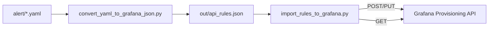
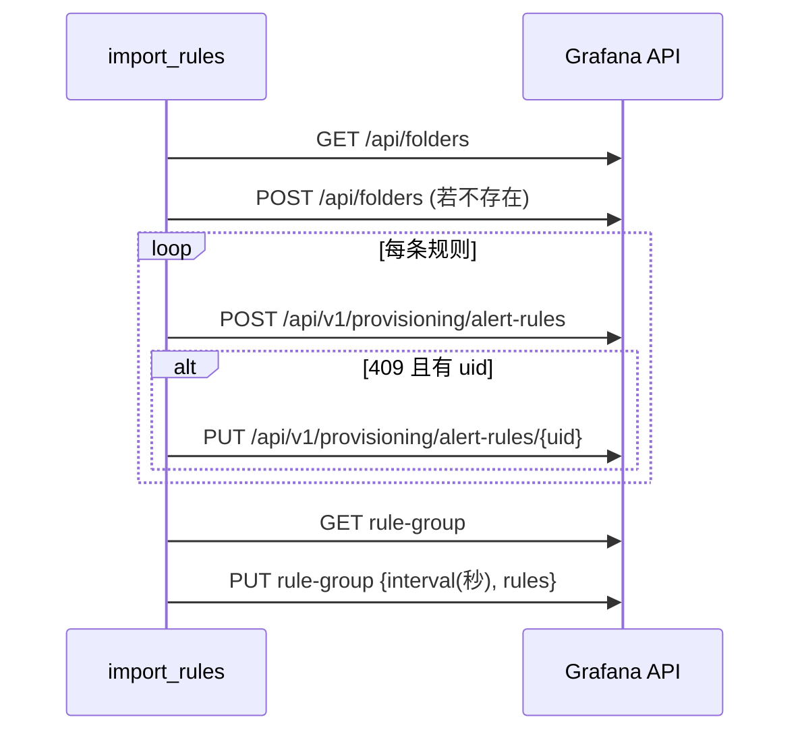

# Grafana 统一告警规则导入与规则组间隔更新脚本 — 设计文档

本文档描述 tools/import_rules_to_grafana.py 的设计、使用与运维要点，涵盖架构、流程、参数、异常处理与恢复等内容。

## 1. 脚本设计思路与解释

### 1.1 总体架构设计
- 角色与边界
  - 规则转换器：将 alert/*.yaml 转换为 HTTP API 可接受的 JSON（out/api_rules.json）。
  - 导入执行器：读取 JSON，调用 Grafana Unified Alerting Provisioning API 创建/更新规则；在组内规则可见后统一更新规则组 interval。
- 组件分层
  - 配置与会话层：环境加载、认证、TLS 校验、重试策略。
  - 元数据层：Folder 查询/创建、Rule Group 查询。
  - 规则导入层：分桶、POST 创建、409 冲突回退 PUT 更新。
  - 组间隔更新层：规则可见性等待、间隔规范化、PUT 更新与错误重试。



### 1.2 核心功能模块
- get_auth_session：构建 requests Session，支持 Bearer/Basic 认证、TLS 校验/关闭、429/5xx 自动重试。
- ensure_folder：GET 查询命中；未命中 POST 创建，返回 folder UID。
- get_rule_group：GET 当前组定义（含 interval 与 rules）。
- import_rules：按 (folder, ruleGroup) 分桶；逐条 POST 创建，遇 409 且有 uid 时回退 PUT 更新；组内规则完成后统一更新组 interval。
- update_rule_group_interval：等待组内 rules 可见；将 interval 解析为整数秒并按调度步长对齐；PUT 发送 { interval(秒), rules }；对 400 进行短暂重试。

### 1.3 关键算法逻辑
- 间隔解析与对齐（_normalize_interval）
  - 接受 ms/s/m/h 后缀或纯数字（视为秒），小于等于 0 回落为默认 60s。
  - 按 scheduler_step（默认 10s）向上对齐：61s→70s，60s→60s，确保可被调度步长整除。
  - PUT 请求体使用整数秒的 interval，避免 0s/非整除导致的 400。
- 幂等与一致性
  - 规则层：以 uid 保证幂等，POST 冲突回退 PUT。
  - 组层：先确保 rules 可见，再更新 interval，避免“空组 PUT”无效重试与告警。

### 1.4 数据流与处理流程
- 输入 JSON 字段：folder、ruleGroup、groupInterval、uid、title、expr、noDataState、for 等；导入时补充 folderUID、orgId。
- 顺序（每组）：ensure_folder → 逐条 POST/409→PUT → 若发现 groupInterval → 规范化 → PUT 组。



## 2. 使用说明

### 2.1 环境要求与依赖项
- OS：Windows/Linux/macOS（示例以 PowerShell 为主）。
- Python：3.8+。
- 依赖：requests（随 requirements.txt 安装）。
- Grafana：9+，启用 Unified Alerting Provisioning API。

### 2.2 安装部署步骤
1) 安装依赖：`pip install -r requirements.txt`
2) 生成输入：运行转换工具，产出 `out/api_rules.json`。
3) 配置环境变量（见下）。
4) 执行导入脚本。

### 2.3 配置参数说明（环境变量）
- GRAFANA_URL：目标地址，如 https://your-grafana/。
- GRAFANA_API_TOKEN：Bearer Token（优先）。
- GRAFANA_USER / GRAFANA_PASSWORD：Basic 认证（不与 Token 同用）。
- GRAFANA_VERIFY：是否校验证书，true/false（生产建议 true）。
- GRAFANA_CA_CERT：自定义 CA 证书路径（PEM）。
- GRAFANA_TIMEOUT：HTTP 超时秒数（默认 60）。

### 2.4 执行方法与命令格式（PowerShell 示例）
```powershell
$env:GRAFANA_URL='https://your-grafana/'
$env:GRAFANA_API_TOKEN='******'      # 或设置 USER/PASSWORD
$env:GRAFANA_VERIFY='false'          # 测试环境可设为 false
python .\tools\import_rules_to_grafana.py
```
返回码：0=成功，非0=失败（详见日志）。

### 2.5 预期输出示例
- Imported: 规则标题 -> uid=xxx
- Updated: 规则标题 -> uid=xxx
- Warning: update_rule_group_interval 组名 failed after retries: 400 {...}

## 3. 注意事项

### 3.1 系统资源要求
- 以网络 I/O 为主，CPU/内存占用较低；规则量大时建议提高超时并保持网络稳定。

### 3.2 权限与安全考量
- 优先使用最小权限的 API Token；避免泄露密码/Token 于命令行或日志。
- 仅在测试环境关闭证书校验；生产提供 CA 证书或使用受信链。

### 3.3 性能优化建议
- 现实现按组顺序导入保障一致性；可在不同组间并发（注意后端限流）。
- 适当调整 requests 重试/超时配置以平衡稳定性与速度。

### 3.4 兼容性说明
- 端点基于 `/api/v1/provisioning/...`（Unified Alerting）；与 Mimir/其它后端可能存在差异，需评估适配。

## 4. 异常处理与意外终止情况

### 4.1 常见错误代码及解决方案
- 400 Bad Request：interval 为 0 或非步长整除 → 已规范化为整数秒并按 10s 对齐；可调整源 groupInterval。
- 401/403：认证或权限不足 → 检查 Token/账号与组织上下文。
- 404：组不存在或尚不可见 → 更新组 interval 前已做可见性等待与重试。
- 409：规则已存在 → 已回退 PUT 更新（需规则含 uid）。
- 429/5xx：请求过多或服务错误 → 会话层自动重试。

### 4.2 日志分析与问题定位
- 成功：Imported/Updated + uid。
- 失败：错误行包含状态码与返回体；组间隔失败会打印 Warning 与最后一次详情。

### 4.3 自动恢复机制
- 幂等：POST 冲突回退 PUT；组间隔更新对 400 做短暂重试。
- 可重复执行：多次运行直至一致，不会重复创建相同规则。

### 4.4 灾难恢复方案
- 备份：保留源 YAML 与 out/api_rules.json；必要时导出组定义比对。
- 回退：修正输入后重新导入；必要时在 UI/API 禁用问题规则。

### 4.5 资源释放与清理
- 无持久资源或临时文件；脚本结束时会话自动回收。

---

附：关键实现要点摘要
- 仅在组内 rules 可见时再统一 PUT 组 interval，避免空组 PUT 报错。
- interval 统一转换为“整数秒”并向上按 10s 对齐，满足调度器整除约束。
- 使用 Bearer/Basic 认证、TLS 校验/关闭、429/5xx 自动重试，提升稳定性。